<div align="center">

### 게임을 기획하고, 직접 만드는 개발자 변현준입니다

**게임 기획 · 실시간 네트워크 동기화 · 상태 머신 설계 · 렌더링 최적화 · 인터랙티브 UI**

게임의 재미를 설계하는 **기획**과, 그것을 실현하는 **클라이언트 개발**을  
모두 경험하며 양쪽의 언어를 이해하는 개발자입니다.

[](https://velog.io/@byjun98)
[](https://github.com/byjun98)
[](https://blog.naver.com/PostList.naver?blogId=byjun_04&from=postList&categoryNo=24&parentCategoryNo=24)

</div>

<br>

## 기술 스택

### Language

      

### Game Engine

   

### Frontend & Mobile

   

### State & Network

   

### Rendering & Visualization

  

### Backend & Database

     

### Art & Design

   

### DevOps & Collaboration

     

<br>

<div align="center">
  <a href="https://github.com/byjun98">
    
  </a>
  <a href="https://github.com/byjun98">
    
  </a>
</div>

<br>

---

## 프로젝트

<br>

### 1. C2S — 웹소켓 기반 실시간 전술 멀티플레이어 시뮬레이터

> **2026.01 ~ 2026.02** · 프론트엔드 담당 (React 19 + TypeScript)

<a href="https://github.com/byjun98/C2S">
  
</a>

#### 프로젝트 스크린샷

| 로비 및 매치메이킹                                  | 전술 맵 동기화                                      |
|:-------------------------------------------:|:---------------------------------------------:|
| 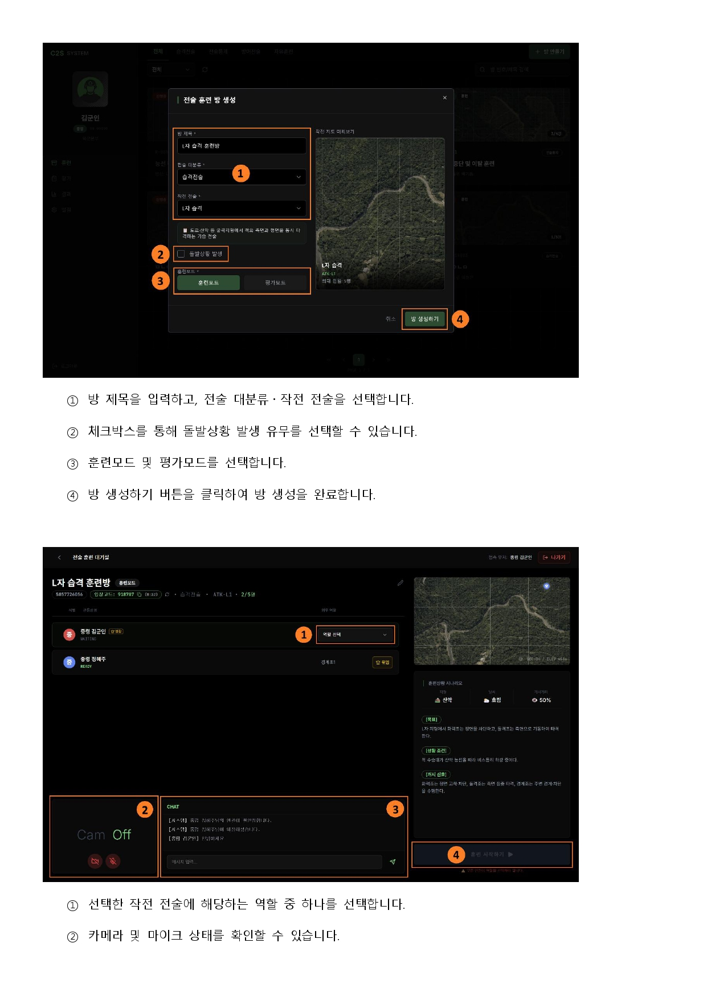 | 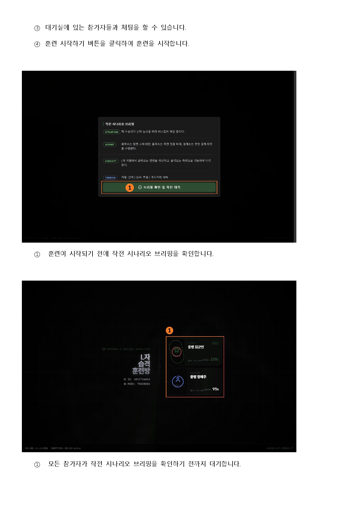 |

| 화상 통신 및 오더                                    | 리플레이 및 분석                                     |
|:---------------------------------------------:|:---------------------------------------------:|
| 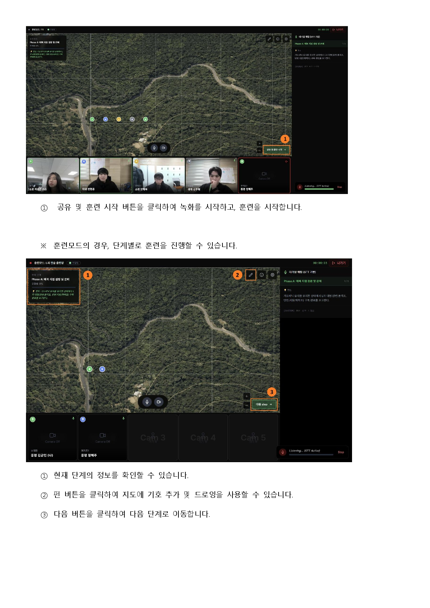 | 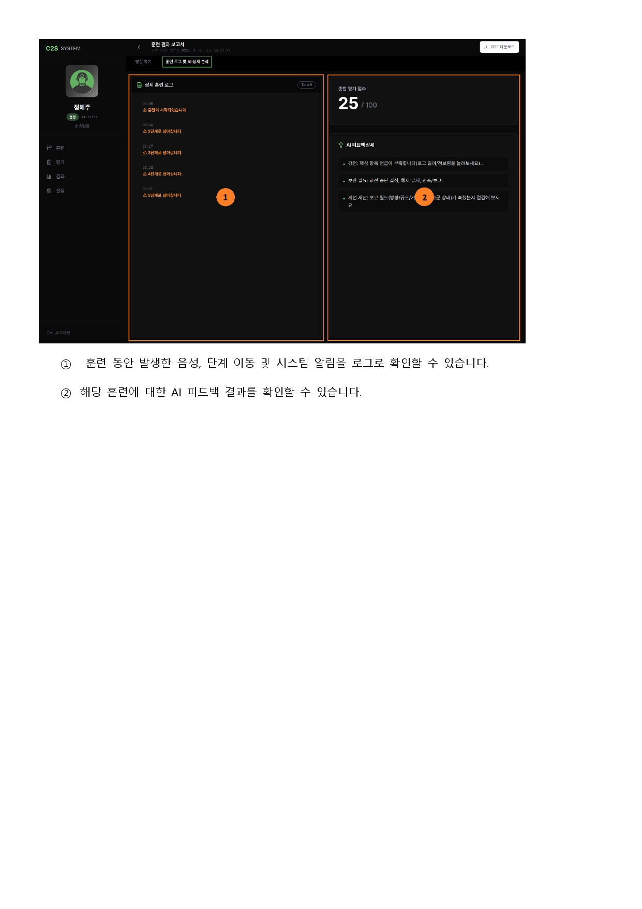 |

#### 프로젝트를 통해 배운 점

| 배운 점              | 구체적 내용                                                                 |
|:----------------- |:---------------------------------------------------------------------- |
| **실시간 네트워크 동기화**  | WebSocket(STOMP)으로 다수 클라이언트 간 유닛 좌표·상태를 실시간 동기화. 낙관적 업데이트로 끊김 없는 UX 구현 |
| **게임 루프 & 상태 머신** | Zustand로 로비→대기→인게임→결과 상태 전이를 중앙 집중 관리. 싱글턴 유사 패턴으로 인게임 데이터 무결성 확보      |
| **관전 & 리플레이 시스템** | 평가관의 실시간 모니터링·개입이 가능한 관전 모드 + 시계열 로그 녹화·재생 리플레이 시스템 개발                 |
| **렌더링 최적화**       | Canvas API 기반 전술 드로잉, 빈번한 유닛 갱신 시 불필요한 리렌더링 방지 및 프레임 방어                |
| **툴 개발**          | 전술 시나리오 편집기 및 실시간 드로잉 툴 직접 구현                                          |

#### 사용 기술

| 영역            | 기술                                                |
|:------------- |:------------------------------------------------- |
| **Frontend**  | `React 19`, `TypeScript`, `Vite`                  |
| **Network**   | `WebSocket (STOMP)`, `OpenVidu (WebRTC)`, `Axios` |
| **State**     | `Zustand`                                         |
| **Rendering** | `Canvas API`, `Tailwind CSS`, `Framer Motion`     |

#### 핵심 성과

- 이벤트 주도 아키텍처로 **다중 접속 환경에서도 데이터 충돌 없는** 안정적 세션 관리
- 웹 기술 기반 **별도 설치 없는 경량 전술 시뮬레이션 클라이언트** 구축
- 전술 데이터 시각화 및 리플레이 기능으로 **게임 운영 툴 개발 역량** 입증

**[GitHub Repository](https://github.com/byjun98/C2S)** | **[시연 영상](https://naver.me/xM5MxOAq)**

---

### 2. ChuraiGame — 개인화 게임 추천 서비스

> **2025.09 ~ 2025.11** · 풀스택 (Django + DRF + Vue 3)

<a href="https://github.com/byjun98/ChuraiGame">
  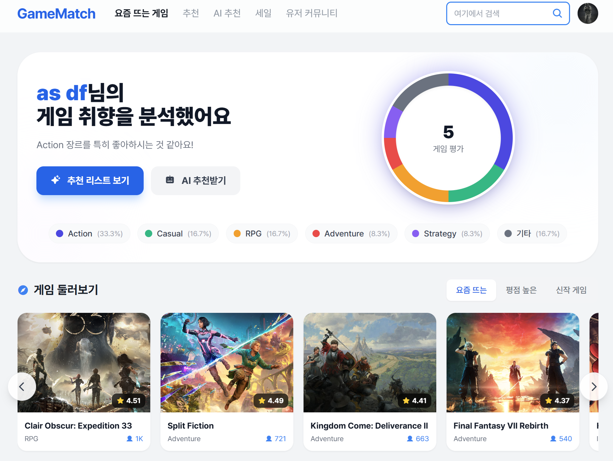
</a>

#### 시연 영상

<div align="center">

[](https://youtu.be/ainlIPd_3Fs?si=CPEJ34y9VbpVI31b)

클릭하면 시연 영상으로 이동합니다

</div>

#### 주요 화면

| 온보딩 — 글로벌 게임 평가                            | 온보딩 — 한국 유행 게임                            |
|:------------------------------------------:|:-----------------------------------------:|
|  | 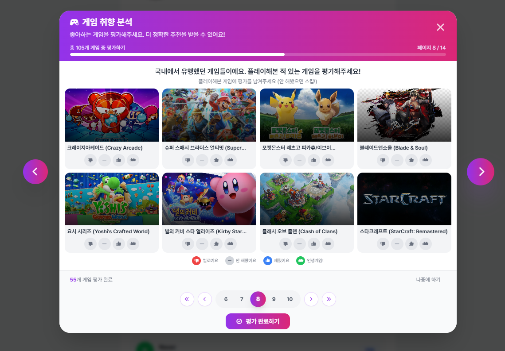 |

| AI 큐레이터 챗봇                                | 맞춤 추천 리스트                                  |
|:-----------------------------------------:|:------------------------------------------:|
| 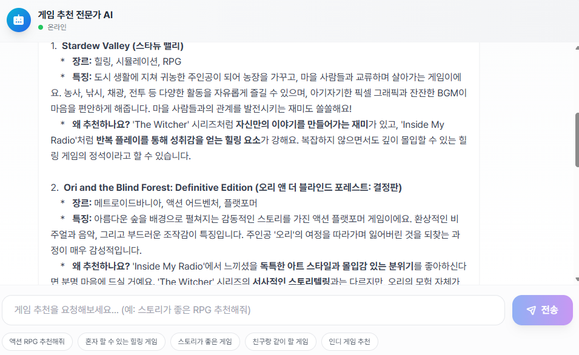 | 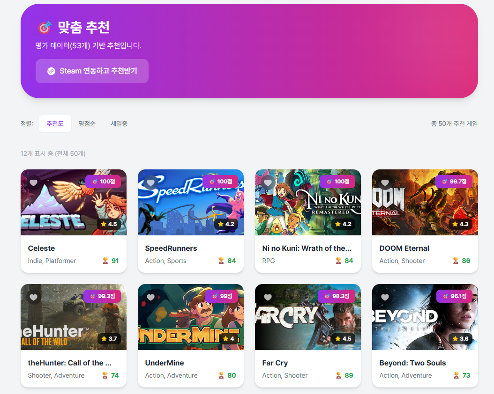 |

| 추천 상세 — 추천 근거 명시                      | 세일 인텔리전스                                |
|:-------------------------------------:|:---------------------------------------:|
| 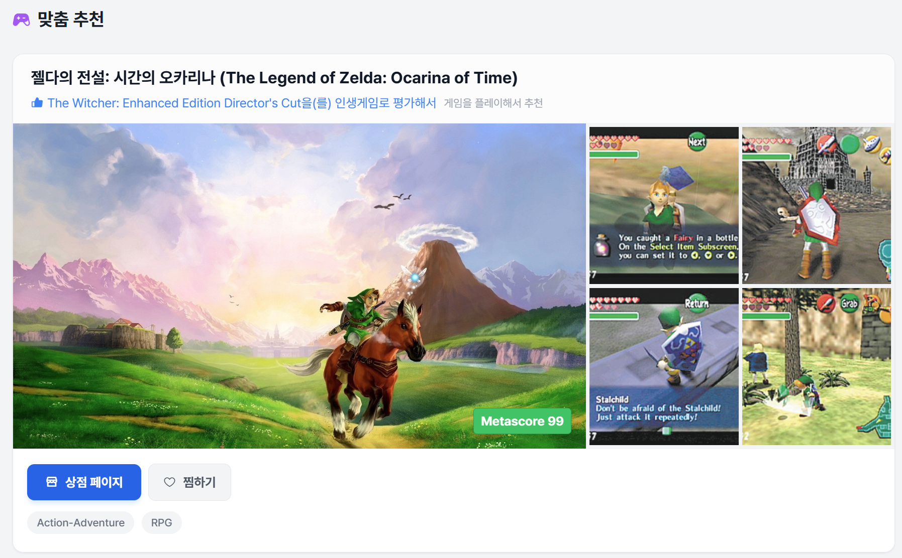 | 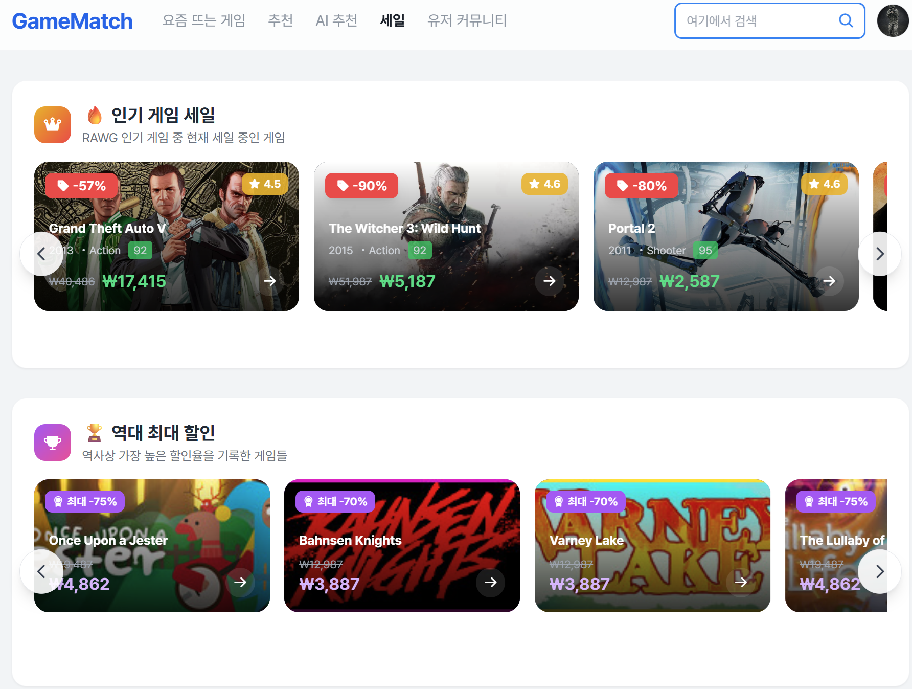 |

| AI 프로필 생성 (입력)                               | AI 프로필 생성 (결과)                              |
|:--------------------------------------------:|:-------------------------------------------:|
| 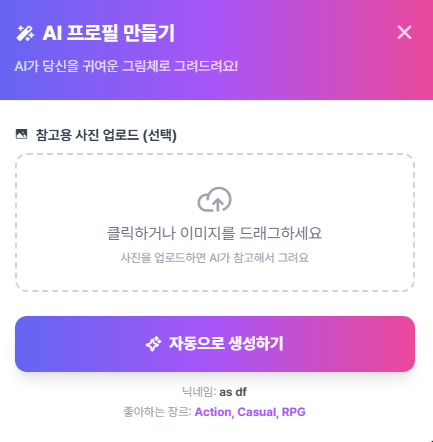 | 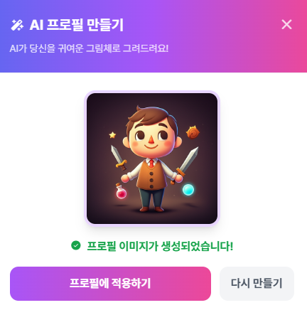 |

#### 핵심 설계

- **하이브리드 추천 엔진**: 협업 필터링(70%) + 장르 Jaccard 유사도(20%) + 메타크리틱(10%) 가중합
- **콜드스타트 해결**: 왓챠식 4점계 온보딩(Steam 게임 500개 + 한국 유행 게임 105개)으로 미가입자도 즉시 추천
- **11단계 데이터 파이프라인**: 16만개 Steam 게임 데이터 수집 → 정제 → 유사도 계산 → 캐시를 독립 배치로 분리
- **API 최적화**: RAWG 호출 112회 → 3회(97.3% 감소), 메인 로딩 9초 → 0.15초(98% 단축)
- **AI 큐레이터**: Gemini 기반 유저 컨텍스트 주입 대화형 추천 + 프로필 이미지 자동 생성

#### 사용 기술

| 영역           | 기술                                                             |
|:------------ |:-------------------------------------------------------------- |
| **Backend**  | `Python`, `Django`, `Django REST Framework`                    |
| **Frontend** | `Vue 3 (CDN)`, `Django Templates`, `Tailwind CSS`              |
| **Data/ML**  | `pandas`, `NumPy`, `SciPy`, `scikit-learn`                     |
| **API**      | `Steam Web API`, `RAWG`, `CheapShark`, `Gemini 2.5 Flash Lite` |

**[GitHub Repository](https://github.com/byjun98/ChuraiGame)**

---

### 3. 족압 측정 앱 (FP2) — Arduino BLE + React Native

> **2024.03 ~ 2024.06** · 1인 개발 (React Native + Expo + Arduino)

<a href="https://github.com/byjun98/foot_pressure_arduino">
  
</a>

#### 프로젝트 스크린샷

| 2D 차트 (실시간)                                                                               | 3D 차트                                                                                     | 녹화 중                                                                                             |
|:-----------------------------------------------------------------------------------------:|:-----------------------------------------------------------------------------------------:|:------------------------------------------------------------------------------------------------:|
|  |  |  |

| BLE 연결                                                                                      | AI 건강 상담                                                                                       | 뉴스 피드                                                                                       |
|:-------------------------------------------------------------------------------------------:|:----------------------------------------------------------------------------------------------:|:-------------------------------------------------------------------------------------------:|
|  |  |  |

#### 프로젝트를 통해 배운 점

| 배운 점             | 구체적 내용                                               |
|:---------------- |:---------------------------------------------------- |
| **하드웨어 통신 프로토콜** | Arduino ESP32 BLE 데이터 파싱을 통해 외부 디바이스와의 저수준 통신 흐름을 이해 |
| **실시간 데이터 시각화**  | 16개 센서 데이터를 2D/3D 차트로 실시간 렌더링하며 프레임 단위 갱신 경험         |
| **녹화/리플레이 설계**   | 10초 단위 센서 데이터 스냅샷 저장 후 별도 화면에서 재분석하는 구조 설계           |
| **상태 관리 최적화**    | Context API → Zustand 전환으로 불필요한 리렌더링 제거, 화면 반응성 개선   |

#### 사용 기술

| 영역                | 기술                                               |
|:----------------- |:------------------------------------------------ |
| **Frontend**      | `React Native`, `Expo`, `TypeScript`             |
| **State**         | `Zustand`                                        |
| **Visualization** | `ECharts`, `ECharts-GL`, `WebView`               |
| **Hardware**      | `Arduino`, `ESP32`, `BLE (react-native-ble-plx)` |
| **Animation**     | `Reanimated`, `Moti`, `NativeWind`               |

#### 핵심 성과

- Zustand 전환으로 센서 데이터 갱신 시 **불필요한 리렌더링 제거** 및 반응성 개선
- 녹화 시점 클로저 버그, 빈 데이터 렌더 루프 등 **핵심 안정성 이슈** 해결
- 차트 로직 공통 컴포넌트화 + TypeScript 전환으로 **유지보수성** 향상

**[GitHub Repository](https://github.com/byjun98/foot_pressure_arduino)**

---

### 4. AniCare Plus — 반려동물 통합 케어 플랫폼

> **2024.03 ~ 2024.06** · 프론트엔드 담당 (React 18)

#### 주요 기능 미리보기

| AI 분석                                 | 카카오맵                                           | 접종 관리                                          |
|:-------------------------------------:|:----------------------------------------------:|:----------------------------------------------:|
| 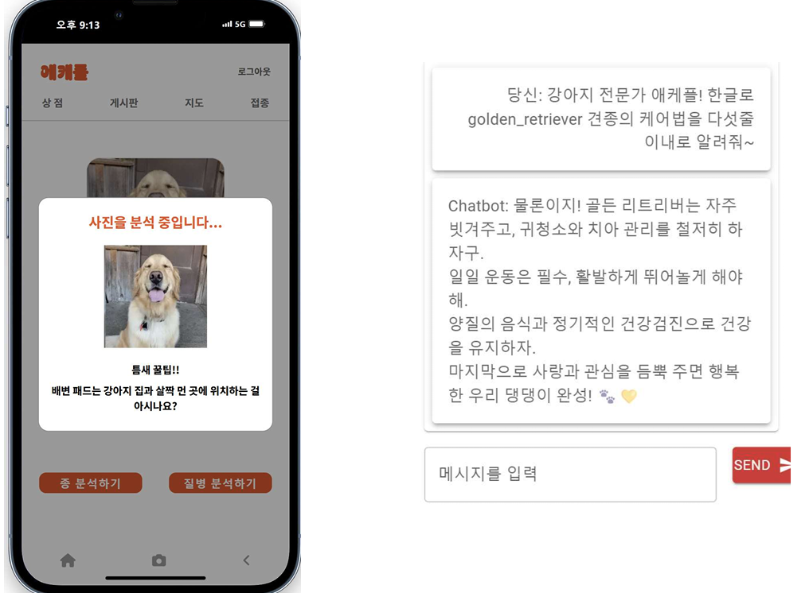 | 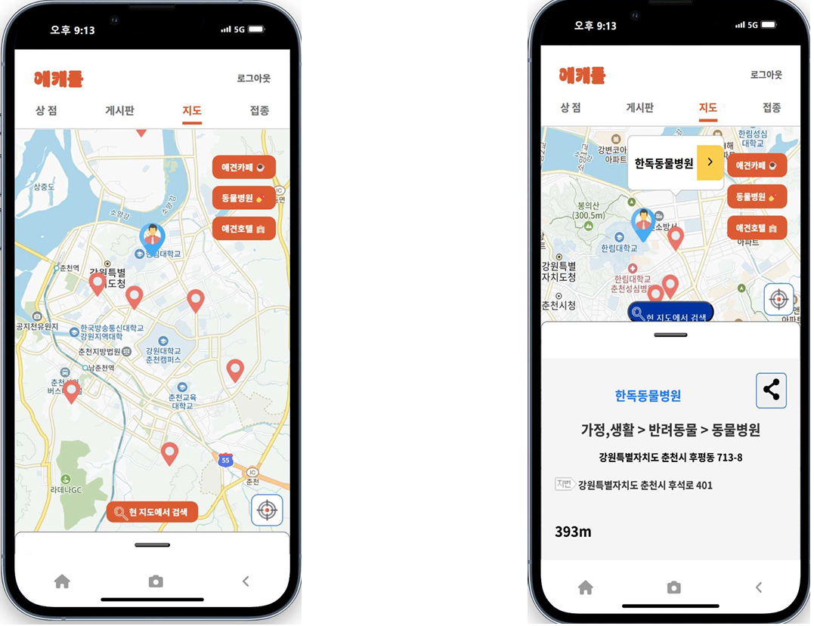 | 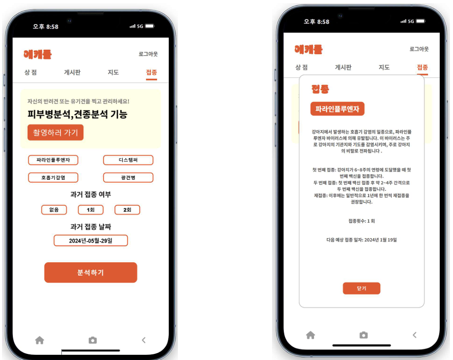 |

| 챗봇                                         | 상점                                      |
|:------------------------------------------:|:---------------------------------------:|
| 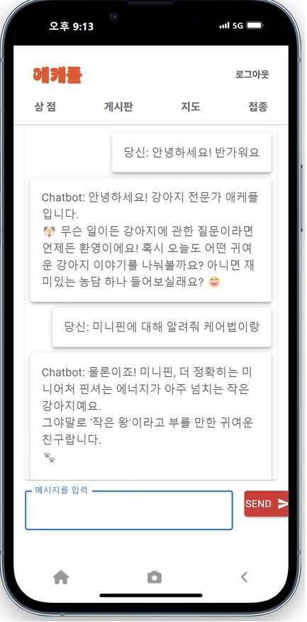 | 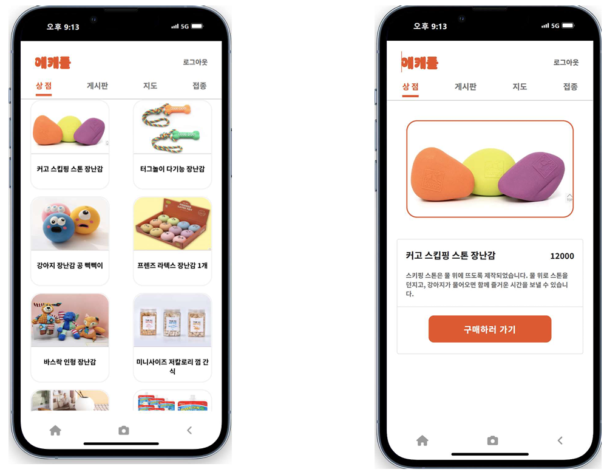 |

#### 시연 영상

<div align="center">

[](https://youtube.com/shorts/fQksFg8KBwA)

클릭하면 시연 영상으로 이동합니다

</div>

#### 프로젝트를 통해 배운 점

| 배운 점               | 구체적 내용                                                    |
|:------------------ |:--------------------------------------------------------- |
| **상태 머신 기반 흐름 제어** | 이미지 선택 → AI 분석 → GPT 프롬프트 생성 → 챗봇 응답까지의 비동기 파이프라인 오케스트레이션 |
| **씬 전환 & 데이터 전달**  | `navigate(state)`로 분석 결과를 다음 화면에 주입하는 구조적 데이터 패싱 설계       |
| **카메라/뷰포트 제어**     | 카카오맵의 `setBounds()`/`panTo()`를 통해 뷰포트 제어와 오브젝트 추적 원리 이해   |
| **데이터 테이블 설계**     | 접종 데이터 룩업 테이블(4종 x 3차수) 설계를 통해 정적 데이터 기반 클라이언트 연산 경험      |
| **로딩 화면 UX**       | AI 분석 대기 중 5초 간격 팁 롤링으로 사용자 이탈 방지 UX 패턴 적용                |

<details>
<summary><b>프론트엔드 기술 상세 (펼치기)</b></summary>

#### 카카오맵 — 뷰포트 시스템 설계

```
사용자 위치(center) → 검색 기준점 → Places API → 검색 결과(search[])
       │                                              │
       ▼                                              ▼
   현재 위치 마커                              결과 마커 렌더링
       │                                              │
       └──── Bounds 계산 ── setBounds() ──── 뷰포트 자동 조정
```

- `setBounds()` = 여러 오브젝트를 모두 포함하도록 뷰포트 조정
- `panTo()` = 특정 오브젝트로 카메라를 부드럽게 이동
- `lastCenter` 캐시 = 카메라 위치를 별도 변수에 캐시하여 뷰 전환 시에도 유지하는 패턴

#### AI 분석 → 챗봇 전환 파이프라인

```
[사용자] → 이미지 선택 → [Camera.js] → FormData POST → [Backend] → Python AI → 견종명 반환
                                                                              │
                                                     GPT 프롬프트 동적 생성 ←──┘
                                                              │
                                                    navigate('/chatbot', { state }) → 챗봇 응답
```

비동기 리소스 로딩 → 로딩 화면 → 씬 전환 흐름을 프론트에서 제어합니다.

#### 반응형 UI — PC/모바일 레이아웃 전환

동일한 `<Modal>` 컴포넌트를 PC에서는 사이드바, 모바일에서는 바텀시트로 렌더링.  
같은 UI 데이터에 대해 플랫폼별 레이아웃을 분리하는 설계 방식입니다.

</details>

#### 사용 기술

| 영역           | 기술                                              |
|:------------ |:----------------------------------------------- |
| **Frontend** | `React 18`, `styled-components`, `MUI`, `Axios` |
| **Backend**  | `Java`, `Spring Boot 3.2`, `JPA`                |
| **AI**       | `TensorFlow (Keras)`, `GPT API`                 |
| **Infra**    | `AWS EC2`, `Docker`                             |

#### 핵심 성과

- JWT 기반 인증 시스템으로 보안 수준 향상 및 세션 관리 비용 절감
- AI 분석 → GPT 케어 가이드 → 챗봇까지 **엔드투엔드 파이프라인** 프론트에서 오케스트레이션

**[GitHub Repository](https://github.com/byjun98/AnimalCarePlus)**

---

## 게임 클라이언트 개발을 향한 여정

<div align="center">

```
┌──────────────────────────────────────────────────────────────────────┐
│                    프로젝트별 핵심 역량 맵                              │
│                                                                      │
│  AniCare Plus (React)          FP2 (React Native + Arduino)          │
│  ├─ 상태 머신 & 씬 전환          ├─ 하드웨어(BLE) 통신 프로토콜         │
│  ├─ 카메라 시스템 (카카오맵)      ├─ 실시간 센서 데이터 시각화           │
│  ├─ 데이터 테이블 설계            ├─ 녹화/리플레이 시스템                │
│  └─ 로딩 UX 설계                 └─ 상태 관리 최적화 (Zustand)         │
│                                                                      │
│  ChuraiGame (Django + Vue)     C2S (React 19 + WebSocket)            │
│  ├─ 데이터 파이프라인 설계        ├─ 실시간 네트워크 동기화              │
│  ├─ 추천 알고리즘 설계            ├─ 게임 루프 & 상태 전이               │
│  ├─ 캐시 최적화                  ├─ 관전/리플레이 시스템                 │
│  └─ AI 연동 & 프롬프트 엔지니어링  ├─ Canvas 기반 렌더링 최적화          │
│                                  └─ 인게임 툴 개발                     │
│                                                                      │
│  ════════════════════════════════════════════════════════════════     │
│  → 모든 프로젝트의 공통분모: 실시간성, 상태 관리, 렌더링 최적화,        │
│    데이터 주도 설계 — 게임 클라이언트 개발의 핵심 역량                   │
└──────────────────────────────────────────────────────────────────────┘
```

</div>

---

<div align="center">

**2024-2026 변현준 · Game Client Developer**

</div>


