<div align="center">

### 게임을 기획하고, 직접 만드는 개발자 변현준입니다

**게임 기획 · 실시간 네트워크 동기화 · 상태 머신 설계 · 렌더링 최적화 · 인터랙티브 UI**

게임의 재미를 설계하는 **기획**과, 그것을 실현하는 **클라이언트 개발**을  
모두 경험하며 양쪽의 언어를 이해하는 개발자입니다.

[](https://velog.io/@byjun98)
[](https://github.com/byjun98)
[](https://blog.naver.com/PostList.naver?blogId=byjun_04&from=postList&categoryNo=24&parentCategoryNo=24)

</div>

<br>

## 기술 스택

### Language

       

### Game Engine

   

### Frontend & Mobile

     

### State & Network

   

### Rendering & Visualization

  

### Backend & Database

      

### Art & Design

   

### DevOps & Collaboration

     

<br>

<div align="center">
  <a href="https://github.com/byjun98">
    
  </a>
  <a href="https://github.com/byjun98">
    
  </a>
</div>

<br>

---

## 팀 프로젝트

<br>
<details>
<summary><b>1. ATORIA — 경주 문화유산 앱과 단독 구현 게임 아토리아 발굴단</b></summary>
<br>

> **2026.04 ~ 2026.05** · 6인 팀 · Android 프론트엔드 및 Unity 콘텐츠 연동 담당 (Kotlin · Jetpack Compose · Unity Library)

<a href="https://github.com/byjun98/Atoria">
  
</a>

#### 원본 서비스 소개

ATORIA는 경주 문화유산 탐방을 **AI 스토리, 장소 기반 미션, 지도 동선, Unity 게임, e-book 결과물**로 연결한 Android 모바일 서비스입니다.  
사용자의 인원과 성향에 맞춰 탐방 이야기를 생성하고, Kakao Map 기반 코스 탐색과 CameraX 현장 미션, 로컬 ONNX 사진 검증, 이동 경로 기록을 하나의 체험 흐름으로 묶었습니다.  
저는 사용자가 직접 만지는 **Android 프론트엔드 전반**과 **Unity 콘텐츠의 Android 앱 연동**을 담당했습니다.

#### 서비스 흐름

| 흐름 | 구현 포인트 |
|:--- |:--- |
| **탐방 설계** | 인원·성향 입력 → AI 스토리/장소별 미션 생성 → 코스 선택 |
| **현장 체험** | Kakao Map 기반 동선 안내, CameraX 촬영, ONNX Runtime 로컬 사진 판별 |
| **결과 기록** | 탐방 사진·미션 결과·AI 스토리를 e-book 형태로 렌더링 |
| **게임 콘텐츠** | Android 앱 내부에서 Unity 게임으로 전환되는 단일 APK 흐름 구성 |

#### 프론트엔드 담당 영역

| 담당 영역 | 구체적 내용 |
|:--- |:--- |
| **Android 앱 흐름** | Jetpack Compose와 Navigation Compose 기반으로 로그인/권한/온보딩/코스/미션/e-book 화면 전환 구조 구현 |
| **지도 기반 UX** | Kakao Map SDK와 Local/Directions API를 활용해 코스 선택, 순서 조정, 주변 문화유산 탐색, 장소 상세 흐름 구성 |
| **현장 미션 검증** | CameraX 촬영 결과의 EXIF/GPS를 확인하고, ONNX Runtime 기반 로컬 이미지 판별 결과를 미션 진행 상태와 연결 |
| **이동 경로 기록** | Foreground Service 기반 위치 추적으로 탐방 동선을 기록하고, 결과 화면과 e-book 기록에 활용 |
| **Unity 모듈 연동** | Unity Library를 Android 앱에 통합해 Compose 화면에서 게임 콘텐츠로 자연스럽게 전환되는 구조 구현 |

#### 메인 구현 — 아토리아 발굴단 (단독 담당)

<a href="https://github.com/byjun98/Atoria_Excavation">
  
</a>

아토리아 안에서 사용자가 직접 플레이하는 모바일 2D 클리커/방치형 채굴 게임을 단독으로 구현했습니다.  
플레이어는 제한 시간 동안 커서를 움직여 암석을 범위 채굴하고, 세션 종료 후 원석을 주괴로 정산해 스킬트리·특성·유물·곡괭이·자동 발굴터를 강화합니다.

#### 사용 기술

| 영역 | 기술 |
|:--- |:--- |
| **Android** | `Kotlin`, `Jetpack Compose`, `Navigation Compose`, `Hilt` |
| **Map/Camera** | `Kakao Map SDK`, `Kakao Local/Directions API`, `CameraX`, `ONNX Runtime` |
| **Game** | `Unity 6000.4.2f1`, `C#`, `URP 17.4`, `Unity uGUI` |
| **Data** | `JSON Save/Load`, `DTO Schema`, `Auto Save`, `Backup Recovery` |

#### 핵심 성과

- Android 앱의 사용자 접점 전반을 맡아 **문화유산 탐방 → 현장 미션 → 결과 기록**까지 이어지는 모바일 UX 구현
- 명령형 SDK(Kakao Map, CameraX, Unity Library)를 Compose 흐름에 연결해 **Android 네이티브 화면과 게임 콘텐츠의 전환 구조** 완성
- 아토리아 발굴단에서 세션 루프, 성장 경제, 저장/복구, 업적/통계까지 **서비스의 메인 게임 콘텐츠 한 사이클을 단독 구현**

**[ATORIA Repository](https://github.com/byjun98/Atoria)** | **[아토리아 발굴단 Repository](https://github.com/byjun98/Atoria_Excavation)**

</details>
<br>

<details>
<summary><b>2. SsafyPlayTime — 래그돌 물리 기반 4인 멀티플레이어 파티 배틀 게임</b></summary>
<br>

> **2026.02 ~ 2026.04** · 6인 팀 · Unity 클라이언트 개발 리드 (C# · Unity 2022.3 LTS · Photon Fusion 2)

<a href="https://github.com/byjun98/SsafyPlayTime">
  
</a>

#### 프로젝트 스크린샷

| 방 생성 & 캐릭터 선택 | 인게임 이동 |
|:--------------------------------------:|:---------------------------------------:|
|  | 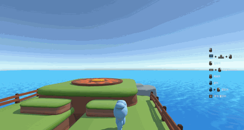 |

| 잡기 & 던지기 | 전투 액션 |
|:--------------------------------------:|:---------------------------------------:|
| 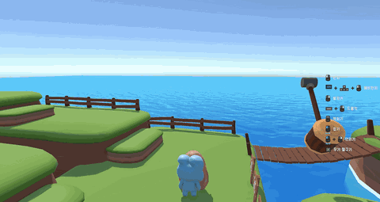 | 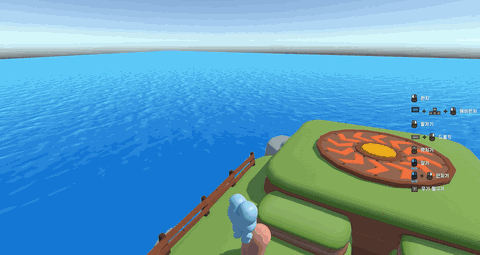 |

#### 프로젝트를 통해 배운 점

| 배운 점                       | 구체적 내용                                                                                                                                                                                                              |
|:-------------------------- |:------------------------------------------------------------------------------------------------------------------------------------------------------------------------------------------------------------------- |
| **래그돌 물리 & 상태 머신 설계**      | PuppetMaster 기반 Active Ragdoll 시스템에서 Stable→GrabIntent→Holding→StunnedCollapse→Stunned→Recovering 등 15개 이상의 PhysicalPhase 상태 전이를 설계. 각 상태별 물리 파라미터(pinWeight, muscleWeight, mappingWeight)를 독립 제어하여 자연스러운 래그돌 전환 구현 |
| **Photon Fusion 네트워크 동기화** | Host-Authoritative 모델에서 15개 관절 회전값(NetworkArray), Hips 절대 위치, 전투 상태를 Networked 속성으로 동기화. OwnerProxy 예측과 StateAuthority 시뮬레이션을 분리하여 입력 지연을 체감 없는 수준으로 감소                                                             |
| **호스트 마이그레이션**             | 방장 이탈 시 SemaphoreSlim 기반 러너 뮤텍스로 NetworkRunner 생성/종료 순서를 보장하고, ReliableData 채널로 참가자 목록·캐릭터 선택·준비 상태를 새 호스트에게 재전송하는 무중단 이관 시스템 구현                                                                                    |
| **전투 시스템 밸런싱**             | CSV 데이터 테이블 기반으로 8종 전투 액션(펀치~던지기)의 데미지/넉백/쿨다운과 8종 아이템의 효과 파라미터를 외부화. 런타임 로더를 통해 코드 변경 없이 밸런스 튜닝 가능한 구조 설계                                                                                                           |
| **물리 기반 그랩/캐리 시스템**        | ConfigurableJoint + CarryRig + CarryPhysicsProfile로 캐릭터 간 물리적 상호작용(잡기→들기→던지기) 체인을 구현. 양손 독립 그랩, 앵커 포인트별 부위 판정, AntiStretch 제약 조건으로 관절 분리 방지                                                                         |
| **퍼포먼스 최적화**               | PuppetMaster LOD 시스템, AOI(Area of Interest) 기반 네트워크 업데이트 범위 제한, 원격 플레이어 물리 비활성화 등으로 4인 동시 접속 시 안정적인 프레임 유지                                                                                                          |

<details>
<summary><b>기술 상세 — 네트워크 아키텍처 (펼치기)</b></summary>

#### 네트워크 동기화 구조

```
[Host (StateAuthority)]
  │
  ├── FixedUpdateNetwork()
  │     ├── GetInput<PlayerNetworkInput>()     ← 모든 클라이언트 입력 수집
  │     ├── 물리 시뮬레이션 (Rigidbody + Joint)
  │     ├── 전투 판정 (히트박스, 데미지, 스턴)
  │     └── Networked 속성 갱신
  │           ├── BoneRotations[15]             ← 관절 회전값 배열
  │           ├── NetworkedHipsPosition         ← 루트 뼈 절대 위치
  │           ├── NetworkedPhysicalPhase        ← 물리 상태 (15종)
  │           ├── NetworkedCarryMode            ← 그랩/캐리 상태
  │           └── AccumulatedStunDamage         ← 기절 데미지 누적치
  │
  ├── [OwnerProxy (InputAuthority)]
  │     ├── 로컬 입력 예측 (이동, 카메라)
  │     ├── 그랩 예측 (짧은 지연 허용)
  │     └── 카메라 앵커 보간 (스냅 방지)
  │
  └── [RemoteProxy]
        ├── Networked 값 기반 포즈 복원
        ├── PuppetMaster LOD 적용
        └── 비물리 애니메이션 재생
```

#### 호스트 마이그레이션 흐름

```
방장 이탈 감지
  │
  ├── OnHostMigration() 콜백
  │     ├── _runnerLock (SemaphoreSlim) 획득
  │     ├── 기존 Runner Shutdown
  │     ├── HostMigrationToken으로 새 Runner 생성
  │     └── StartGame(StartGameArgs.HostMigration)
  │
  ├── 새 호스트 확정 후
  │     ├── ReliableData로 캐릭터 선택 재전송
  │     ├── ReliableData로 Ready 상태 재전송
  │     └── 참가자 로스터 재구성
  │
  └── _pendingMigrationToken
        └── 처리 중 수신된 토큰은 큐잉 후 순차 처리
```

</details>

#### 사용 기술

| 영역            | 기술                                                                     |
|:------------- |:---------------------------------------------------------------------- |
| **Engine**    | `Unity 2022.3.62f3 LTS`, `URP 14.0`, `C#`                              |
| **Network**   | `Photon Fusion 2`, `Photon Realtime`, `ReliableData`                   |
| **Physics**   | `PuppetMaster`, `Active Ragdoll`, `ConfigurableJoint`, `Rigidbody`     |
| **Animation** | `Cinemachine 2.10.6`, `Animator State Machine`, `Procedural Animation` |
| **Data**      | `CSV 기반 데이터 테이블` (전투 파라미터, 아이템, VFX, SFX)                              |
| **Infra**     | `Docker`, `MySQL 8.0`, `Redis`, `Spring Boot`                          |

#### 핵심 성과

- PuppetMaster + Photon Fusion 조합으로 **래그돌 물리가 네트워크로 동기화되는 멀티플레이어 전투**를 구현, 상용 게임 수준의 히트 피드백 달성
- 15개 관절 회전 + Hips 절대 위치의 **최소 대역폭 동기화 설계**로 4인 동시 접속 시에도 원격 캐릭터 포즈 정확도 유지
- 호스트 마이그레이션 시 **세션·캐릭터·준비 상태 무손실 이관** 구현으로 게임 중단 없는 플레이 보장
- CSV 외부화 + 런타임 로더로 **코드 변경 없이 전투 밸런스를 조정**할 수 있는 데이터 주도 설계 적용

**[GitHub Repository](https://github.com/byjun98/SsafyPlayTime)**

</details>
<br>

<details>
<summary><b>3. C2S — 웹소켓 기반 실시간 전술 멀티플레이어 시뮬레이터</b></summary>
<br>

> **2026.01 ~ 2026.02** · 6인 팀 · 프론트엔드 담당 (React 19 + TypeScript)

<a href="https://github.com/byjun98/C2S">
  
</a>

#### 프로젝트 스크린샷

| 로비 및 매치메이킹                                  | 전술 맵 동기화                                      |
|:-------------------------------------------:|:---------------------------------------------:|
| 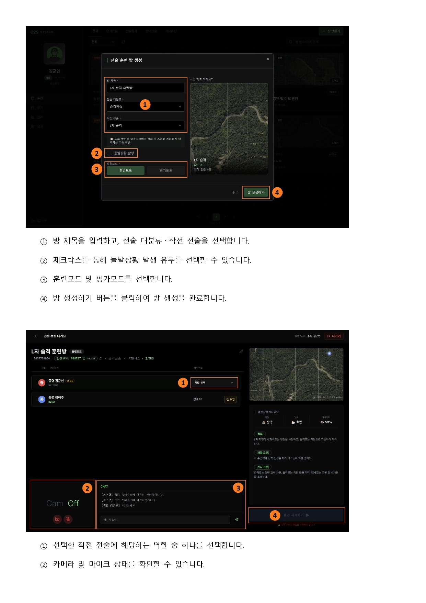 | 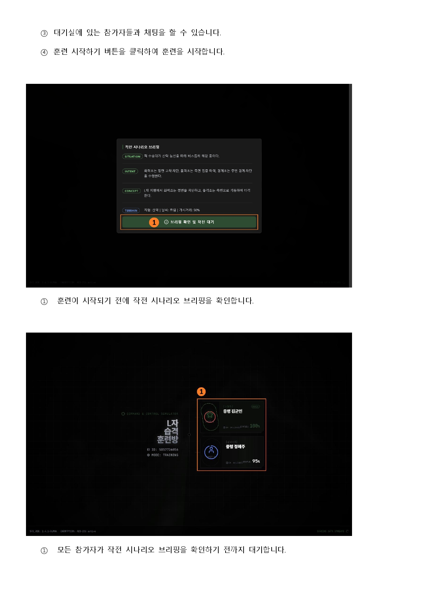 |

| 화상 통신 및 오더                                    | 리플레이 및 분석                                     |
|:---------------------------------------------:|:---------------------------------------------:|
| 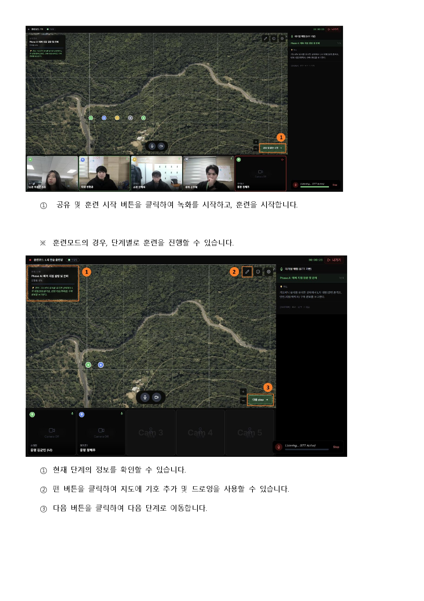 | 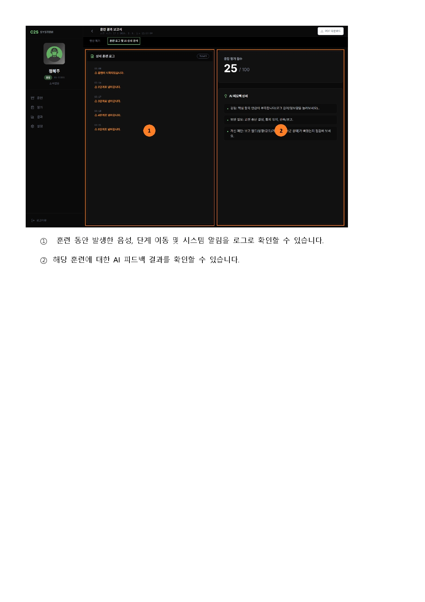 |

#### 프로젝트를 통해 배운 점

| 배운 점              | 구체적 내용                                                                 |
|:----------------- |:---------------------------------------------------------------------- |
| **실시간 네트워크 동기화**  | WebSocket(STOMP)으로 다수 클라이언트 간 유닛 좌표·상태를 실시간 동기화. 낙관적 업데이트로 끊김 없는 UX 구현 |
| **게임 루프 & 상태 머신** | Zustand로 로비→대기→인게임→결과 상태 전이를 중앙 집중 관리. 싱글턴 유사 패턴으로 인게임 데이터 무결성 확보      |
| **관전 & 리플레이 시스템** | 평가관의 실시간 모니터링·개입이 가능한 관전 모드 + 시계열 로그 녹화·재생 리플레이 시스템 개발                 |
| **렌더링 최적화**       | Canvas API 기반 전술 드로잉, 빈번한 유닛 갱신 시 불필요한 리렌더링 방지 및 프레임 방어                |
| **툴 개발**          | 전술 시나리오 편집기 및 실시간 드로잉 툴 직접 구현                                          |

#### 사용 기술

| 영역            | 기술                                                |
|:------------- |:------------------------------------------------- |
| **Frontend**  | `React 19`, `TypeScript`, `Vite`                  |
| **Network**   | `WebSocket (STOMP)`, `OpenVidu (WebRTC)`, `Axios` |
| **State**     | `Zustand`                                         |
| **Rendering** | `Canvas API`, `Tailwind CSS`, `Framer Motion`     |

#### 핵심 성과

- 이벤트 주도 아키텍처로 **다중 접속 환경에서도 데이터 충돌 없는** 안정적 세션 관리
- 웹 기술 기반 **별도 설치 없는 경량 전술 시뮬레이션 클라이언트** 구축
- 전술 데이터 시각화 및 리플레이 기능으로 **게임 운영 툴 개발 역량** 입증

**[GitHub Repository](https://github.com/byjun98/C2S)** | **[시연 영상](https://naver.me/xM5MxOAq)**

</details>
<br>

<details>
<summary><b>4. ChuraiGame — 개인화 게임 추천 서비스</b></summary>
<br>

> **2025.09 ~ 2025.11** · 2인 팀 · 풀스택 담당 (Django + DRF + Vue 3)

<a href="https://github.com/byjun98/ChuraiGame">
  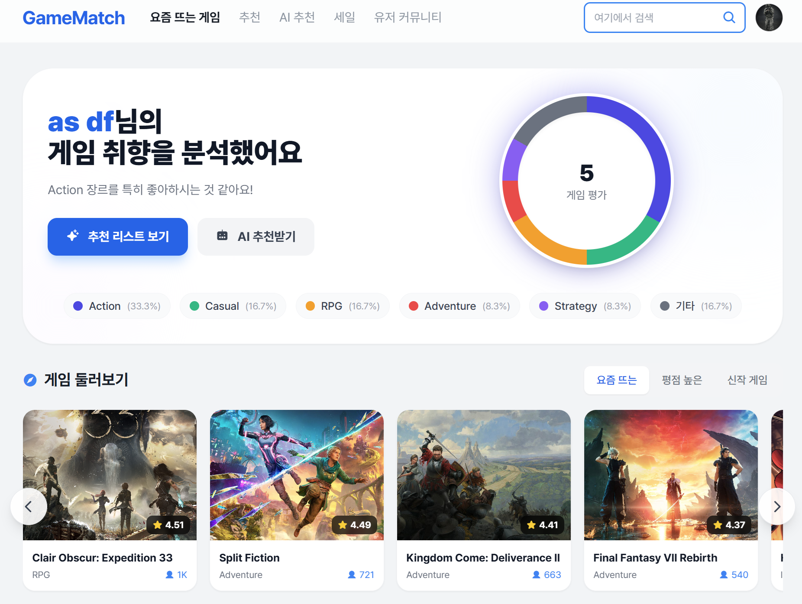
</a>

#### 시연 영상

<div align="center">

[](https://youtu.be/ainlIPd_3Fs?si=CPEJ34y9VbpVI31b)

클릭하면 시연 영상으로 이동합니다

</div>

#### 주요 화면

| 온보딩 — 글로벌 게임 평가                            | 온보딩 — 한국 유행 게임                            |
|:------------------------------------------:|:-----------------------------------------:|
| 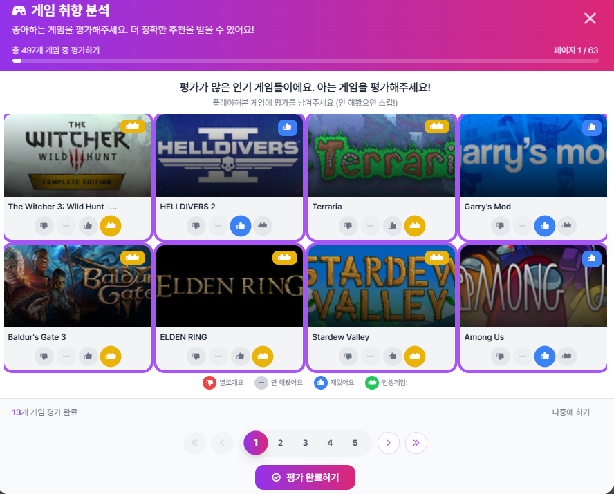 | 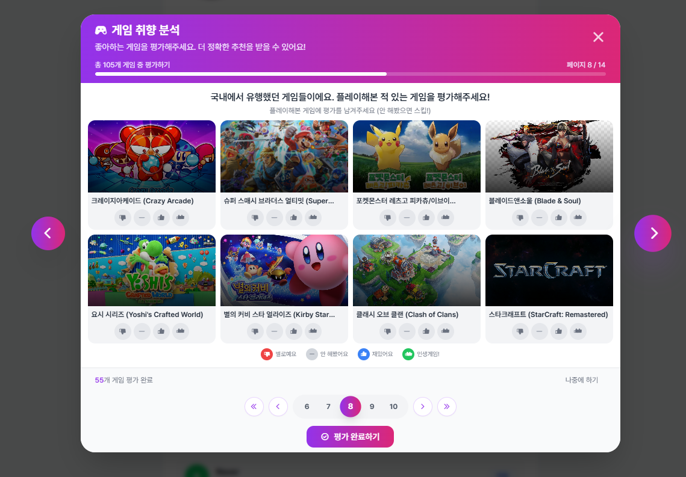 |

| AI 큐레이터 챗봇                                | 맞춤 추천 리스트                                  |
|:-----------------------------------------:|:------------------------------------------:|
| 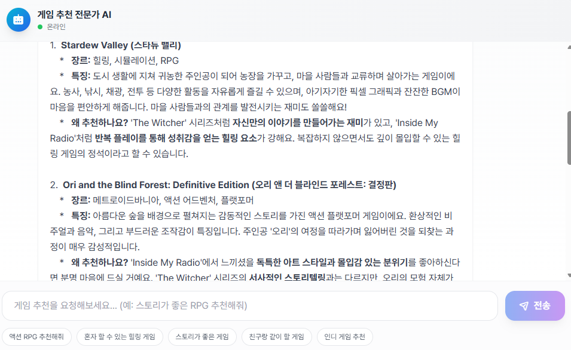 | 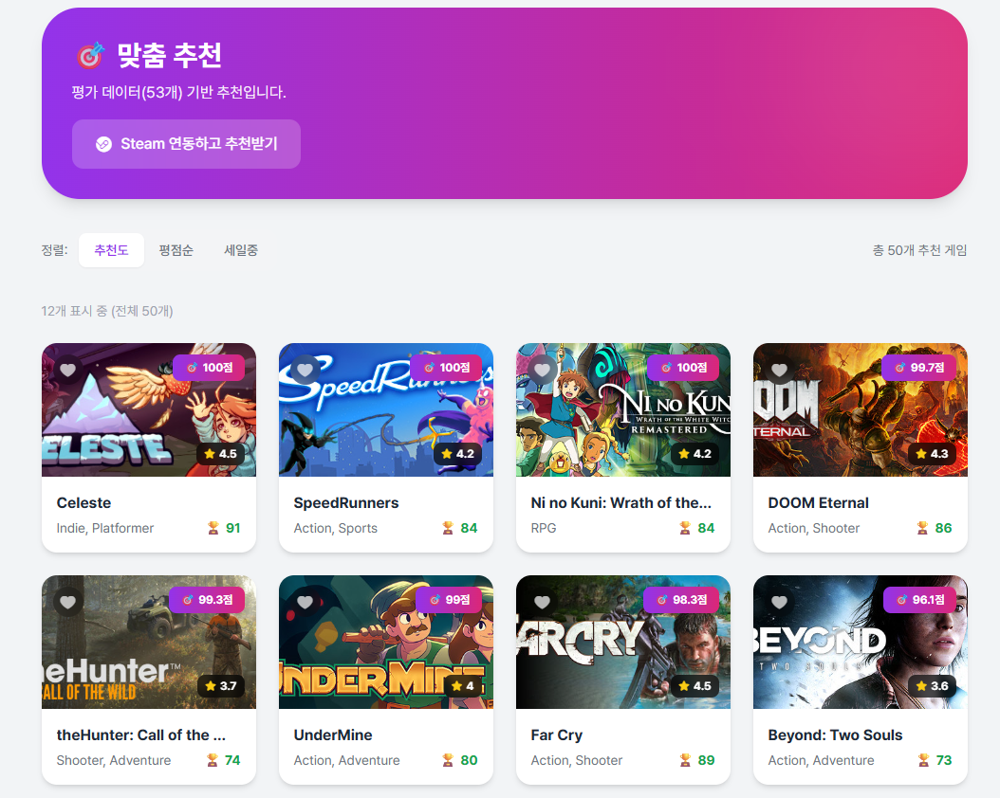 |

| 추천 상세 — 추천 근거 명시                      | 세일 인텔리전스                                |
|:-------------------------------------:|:---------------------------------------:|
| 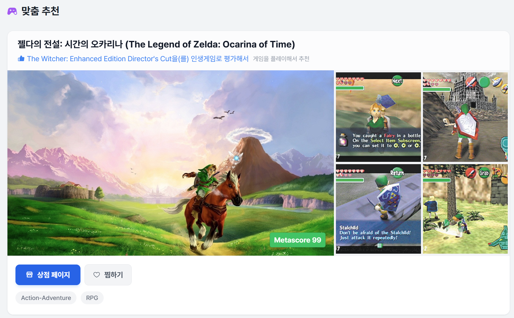 | 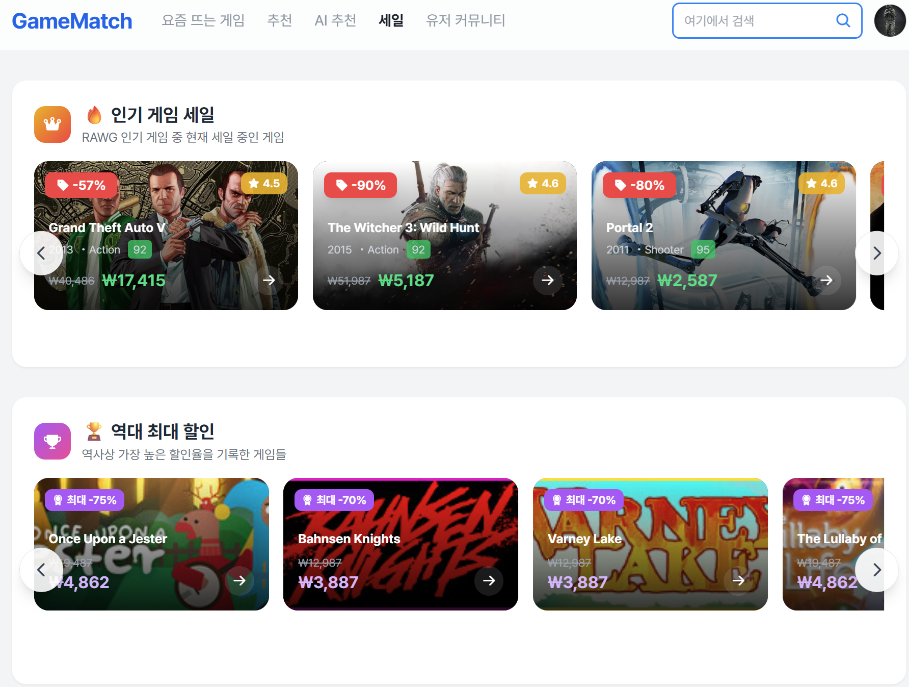 |

| AI 프로필 생성 (입력)                               | AI 프로필 생성 (결과)                              |
|:--------------------------------------------:|:-------------------------------------------:|
| 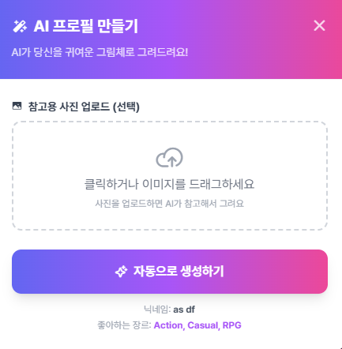 | 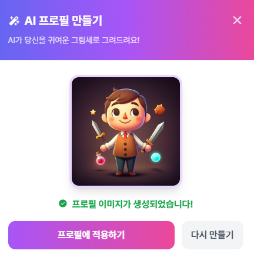 |

#### 핵심 설계

- **하이브리드 추천 엔진**: 협업 필터링(70%) + 장르 Jaccard 유사도(20%) + 메타크리틱(10%) 가중합
- **콜드스타트 해결**: 왓챠식 4점계 온보딩(Steam 게임 500개 + 한국 유행 게임 105개)으로 미가입자도 즉시 추천
- **11단계 데이터 파이프라인**: 16만개 Steam 게임 데이터 수집 → 정제 → 유사도 계산 → 캐시를 독립 배치로 분리
- **API 최적화**: RAWG 호출 112회 → 3회(97.3% 감소), 메인 로딩 9초 → 0.15초(98% 단축)
- **AI 큐레이터**: Gemini 기반 유저 컨텍스트 주입 대화형 추천 + 프로필 이미지 자동 생성

#### 사용 기술

| 영역           | 기술                                                             |
|:------------ |:-------------------------------------------------------------- |
| **Backend**  | `Python`, `Django`, `Django REST Framework`                    |
| **Frontend** | `Vue 3 (CDN)`, `Django Templates`, `Tailwind CSS`              |
| **Data/ML**  | `pandas`, `NumPy`, `SciPy`, `scikit-learn`                     |
| **API**      | `Steam Web API`, `RAWG`, `CheapShark`, `Gemini 2.5 Flash Lite` |

**[GitHub Repository](https://github.com/byjun98/ChuraiGame)**

</details>
<br>

<details>
<summary><b>5. AniCare Plus — 반려동물 통합 케어 플랫폼</b></summary>
<br>

> **2024.03 ~ 2024.06** · 6인 팀 · 프론트엔드 담당 (React 18)

#### 주요 기능 미리보기

| AI 분석                                 | 카카오맵                                           | 접종 관리                                          |
|:-------------------------------------:|:----------------------------------------------:|:----------------------------------------------:|
| 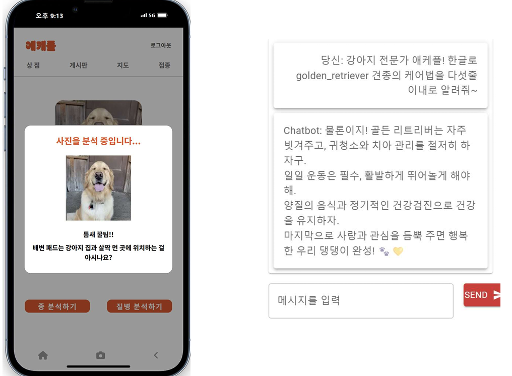 | 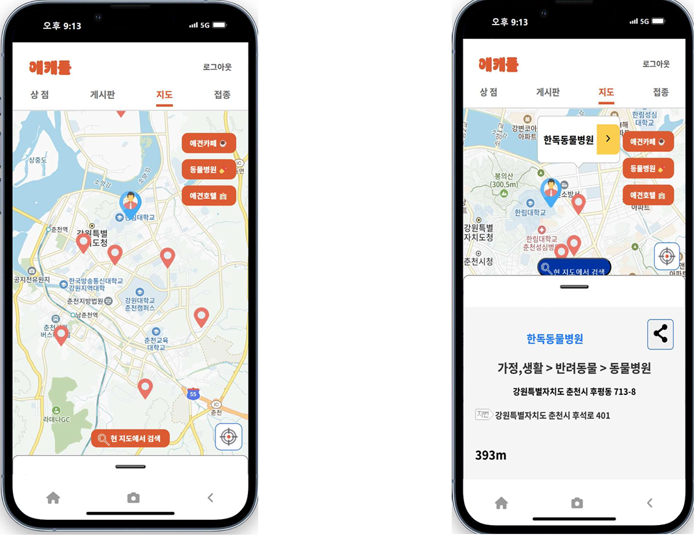 | 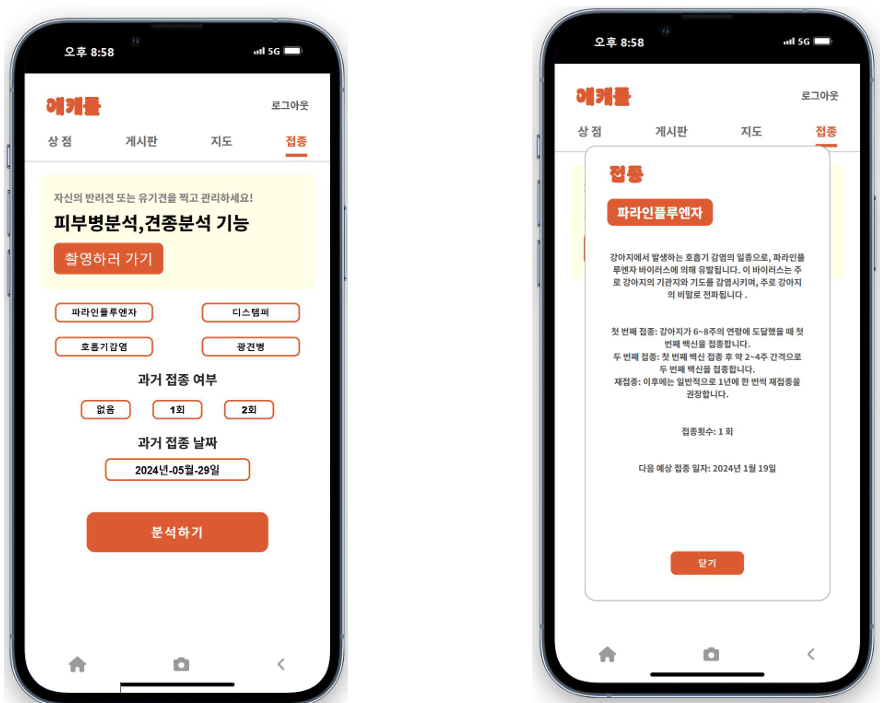 |

| 챗봇                                         | 상점                                      |
|:------------------------------------------:|:---------------------------------------:|
| 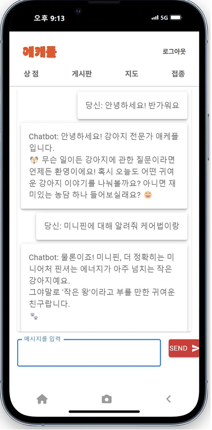 | 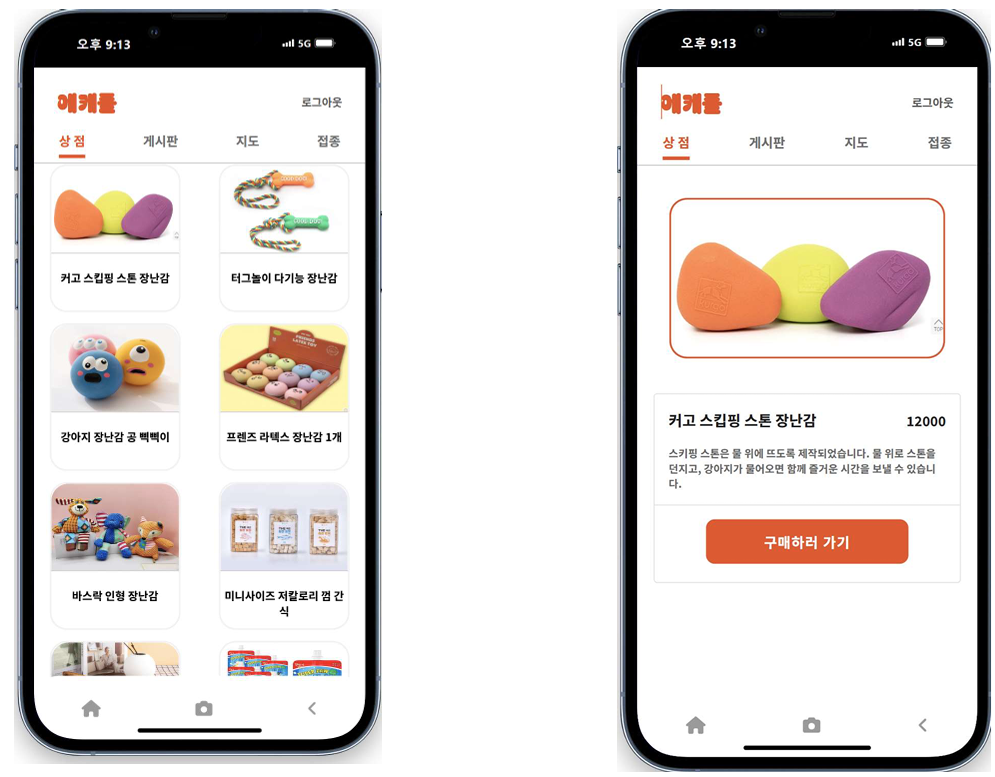 |

#### 시연 영상

<div align="center">

[](https://youtube.com/shorts/fQksFg8KBwA)

클릭하면 시연 영상으로 이동합니다

</div>

#### 프로젝트를 통해 배운 점

| 배운 점               | 구체적 내용                                                    |
|:------------------ |:--------------------------------------------------------- |
| **상태 머신 기반 흐름 제어** | 이미지 선택 → AI 분석 → GPT 프롬프트 생성 → 챗봇 응답까지의 비동기 파이프라인 오케스트레이션 |
| **씬 전환 & 데이터 전달**  | `navigate(state)`로 분석 결과를 다음 화면에 주입하는 구조적 데이터 패싱 설계       |
| **카메라/뷰포트 제어**     | 카카오맵의 `setBounds()`/`panTo()`를 통해 뷰포트 제어와 오브젝트 추적 원리 이해   |
| **데이터 테이블 설계**     | 접종 데이터 룩업 테이블(4종 x 3차수) 설계를 통해 정적 데이터 기반 클라이언트 연산 경험      |
| **로딩 화면 UX**       | AI 분석 대기 중 5초 간격 팁 롤링으로 사용자 이탈 방지 UX 패턴 적용                |

<details>
<summary><b>프론트엔드 기술 상세 (펼치기)</b></summary>

#### 카카오맵 — 뷰포트 시스템 설계

```
사용자 위치(center) → 검색 기준점 → Places API → 검색 결과(search[])
       │                                              │
       ▼                                              ▼
   현재 위치 마커                              결과 마커 렌더링
       │                                              │
       └──── Bounds 계산 ── setBounds() ──── 뷰포트 자동 조정
```

- `setBounds()` = 여러 오브젝트를 모두 포함하도록 뷰포트 조정
- `panTo()` = 특정 오브젝트로 카메라를 부드럽게 이동
- `lastCenter` 캐시 = 카메라 위치를 별도 변수에 캐시하여 뷰 전환 시에도 유지하는 패턴

#### AI 분석 → 챗봇 전환 파이프라인

```
[사용자] → 이미지 선택 → [Camera.js] → FormData POST → [Backend] → Python AI → 견종명 반환
                                                                              │
                                                     GPT 프롬프트 동적 생성 ←──┘
                                                              │
                                                    navigate('/chatbot', { state }) → 챗봇 응답
```

비동기 리소스 로딩 → 로딩 화면 → 씬 전환 흐름을 프론트에서 제어합니다.

#### 반응형 UI — PC/모바일 레이아웃 전환

동일한 `<Modal>` 컴포넌트를 PC에서는 사이드바, 모바일에서는 바텀시트로 렌더링.  
같은 UI 데이터에 대해 플랫폼별 레이아웃을 분리하는 설계 방식입니다.

</details>

#### 사용 기술

| 영역           | 기술                                              |
|:------------ |:----------------------------------------------- |
| **Frontend** | `React 18`, `styled-components`, `MUI`, `Axios` |
| **Backend**  | `Java`, `Spring Boot 3.2`, `JPA`                |
| **AI**       | `TensorFlow (Keras)`, `GPT API`                 |
| **Infra**    | `AWS EC2`, `Docker`                             |

#### 핵심 성과

- JWT 기반 인증 시스템으로 보안 수준 향상 및 세션 관리 비용 절감
- AI 분석 → GPT 케어 가이드 → 챗봇까지 **엔드투엔드 파이프라인** 프론트에서 오케스트레이션

**[GitHub Repository](https://github.com/byjun98/AnimalCarePlus)**

</details>
<br>

---

## 개인 프로젝트

<br>
<details>
<summary><b>1. Unity RAG Relationship System Samples — 로컬 RAG 기반 캐릭터 대화 샘플</b></summary>
<br>

> **2026.05** · 1인 개발 (Unity 6 · FastAPI · SQLite · Ollama)

<a href="https://github.com/byjun98/unity-rag-relationship-system-samples">
  
</a>

#### 프로젝트 소개

Unity 클라이언트가 캐릭터 상태를 FastAPI 기반 로컬 RAG 서버에 보내고, 서버가 SQLite 카드 DB와 로컬 임베딩 모델을 이용해 짧은 대화 응답을 생성하는 샘플입니다.  
캐릭터의 관계/상황 데이터를 API 요청으로 넘기고, 응답의 `emotion`/`motion` 태그를 Unity 표정·모션 흐름에 반영하는 구조를 실험했습니다.

#### 핵심 설계

| 영역 | 구체적 내용 |
|:--- |:--- |
| **Unity 클라이언트** | 선물/상담 UI 흐름, 캐릭터 상태 수집, API 요청/응답 처리, 표정·모션 태그 반영 |
| **RAG 서버** | FastAPI 서버에서 SQLite 카드 DB, CSV 템플릿, 임베딩 검색 유틸리티를 연결 |
| **로컬 모델 연동** | Ollama 임베딩 모델을 사용해 외부 서비스 의존도를 낮춘 로컬 검색 흐름 구성 |
| **데모 자동화** | Unity Editor 메뉴로 데모 씬을 생성하고, `pytest`로 RAG 검색 결과를 검증 |

#### 사용 기술

| 영역 | 기술 |
|:--- |:--- |
| **Client** | `Unity 6`, `C#`, `Unity uGUI` |
| **Server** | `Python`, `FastAPI`, `pytest` |
| **Data/RAG** | `SQLite`, `CSV Template`, `Embedding Search`, `Ollama` |
| **Integration** | `HTTP API`, `emotion/motion tags`, `Editor Demo Scene` |

#### 핵심 성과

- Unity 캐릭터 상태와 로컬 RAG 서버를 연결해 **게임 클라이언트-생성형 AI 연동 구조**를 샘플화
- 공개 가능한 코드와 테스트 중심으로 구성해 **원본 자산과 private seed 없이도 구조를 검토할 수 있는 저장소**로 정리
- 캐릭터 응답을 텍스트에만 두지 않고 표정·모션 태그로 분리해 **대화 결과를 게임 표현으로 연결하는 흐름** 구현

**[GitHub Repository](https://github.com/byjun98/unity-rag-relationship-system-samples)**

</details>
<br>

<details>
<summary><b>2. Unity 2D Platformer Samples — Coyote Time & Jump Buffer</b></summary>
<br>

> **2026.05** · 1인 개발 (C# · Unity 6 · 2D URP · New Input System)

<a href="https://github.com/byjun98/unity-2d-platformer-samples">
  
</a>

#### 프로젝트 소개

2D 플랫포머의 조작감을 개선하는 **Coyote Time, Jump Buffer, Jump Cut, Fast Fall**을 Unity로 구현한 학습용 샘플입니다.  
눈에 보이지 않는 입력 보정 상태를 HUD 게이지로 시각화해, 점프가 실행되는 이유와 튜닝 값을 직접 확인할 수 있도록 구성했습니다.

#### 어려웠던 점과 해결

| 문제 | 해결 |
|:--- |:--- |
| **접지 판정 오탐** | `OverlapBoxAll` 결과에서 자기 자신, 트리거 콜라이더, 벽 접촉을 제외하는 가드 조건을 추가해 무한 점프 버그 방지 |
| **입력 보정 충돌** | 점프 실행 시 `coyoteCounter`와 `bufferCounter`를 동시에 초기화해 코요테 타임과 점프 버퍼가 중복 발동하지 않도록 처리 |
| **프레임 순서 이슈** | 입력은 `Update`, 물리 이동은 `FixedUpdate`로 분리하고 카운터 값을 명시적으로 전달해 입력 누락과 중복 실행을 줄임 |
| **반복 실험 환경** | `EditorSceneManager`, `AssetDatabase`, `SerializedObject` 기반 씬 자동 생성 도구로 샘플 씬 복구와 튜닝 반복을 자동화 |

#### 사용 기술

| 영역 | 기술 |
|:--- |:--- |
| **Engine** | `Unity 6000.4.2f1`, `2D URP 17.4`, `C#` |
| **Input/Physics** | `New Input System`, `Rigidbody2D`, `OverlapBoxAll` |
| **Gameplay** | `Coyote Time`, `Jump Buffer`, `Jump Cut`, `Fast Fall` |
| **Tooling** | `EditorSceneManager`, `AssetDatabase`, `SerializedObject` |

#### 핵심 성과

- 보이지 않는 입력 보정 로직을 HUD로 드러내 **클라이언트 디버깅과 기획 튜닝이 가능한 샘플** 구현
- 접지 판정, 입력 버퍼, 물리 업데이트 순서에서 발생하는 경계 케이스를 정리해 **플랫포머 조작감의 핵심 패턴** 체득
- 코드 기반 씬 재생성 도구로 **반복 실험 가능한 Unity 학습 환경** 구성

**[GitHub Repository](https://github.com/byjun98/unity-2d-platformer-samples)**

</details>
<br>

<details>
<summary><b>3. 3D Destruction Sandbox — Unity 파괴·붕괴·슬라이싱 시뮬레이션 샘플</b></summary>
<br>

> **2026.05** · 1인 개발 (C# · Unity 2022.3 LTS · URP 14 · Mesh API)

#### 프로젝트 소개

Unity URP 환경에서 게임 속 물리 연출로 자주 쓰이는 **파괴, 붕괴, 화재 전파, 메시 슬라이싱**을 직접 구현한 3D 시뮬레이션 샘플입니다.  
정밀 물리 재현보다 게임 클라이언트 관점의 체감 품질, 비용 상한, 단계적 연출 설계를 검증하는 데 초점을 맞췄습니다.

#### 핵심 설계

| 구현 영역 | 구체적 내용 |
|:--- |:--- |
| **파괴 연출** | 모델 교체형 파괴, 복셀 건물 파괴, 구조 응력 붕괴를 각각 다른 데이터 구조로 구현 |
| **연쇄 시뮬레이션** | 그리드 기반 화재 전파를 셀 상태 머신과 활성 셀 큐로 관리해 최악의 한 프레임 비용을 제한 |
| **소프트바디 차량** | 노드-빔 구조와 패널 디포머를 분리해 충돌 후 차체가 변형되는 느낌을 가볍게 표현 |
| **메시 슬라이싱** | 런타임 평면 분할, cap triangulation, 서브메시 보존으로 절단면이 있는 오브젝트 분리 구현 |
| **공통 구조** | 입력/시뮬레이션/표현 계층을 분리하고 `TakeDamage`, `ApplyExplosion`, `TrySlice` 같은 좁은 진입점으로 재사용성 확보 |

#### 사용 기술

| 영역 | 기술 |
|:--- |:--- |
| **Engine** | `Unity 2022.3.62f3 LTS`, `URP 14`, `C#` |
| **Simulation** | `Unity Physics`, `Mesh API`, `Custom Simulation` |
| **Data Structure** | `Grid Cell State`, `BFS Chunk Split`, `Load Graph`, `Node-Beam` |
| **Tooling** | `Editor Scene Builder`, `URP Material Normalizer` |

#### 핵심 성과

- 외부 destruction 라이브러리 없이 **게임용 파괴/붕괴 연출 6종**을 Unity 표준 기능과 커스텀 시뮬레이션으로 구현
- 한 프레임에 몰리는 비용을 큐와 단계 전이로 나누어 **시뮬레이션 안정성과 연출 품질의 절충점**을 실험
- 파괴 시스템을 데이터 변화 중심으로 구성해 **무기, 폭발, 근접 타격 등 다양한 입력 출처에 재사용 가능한 구조** 설계

**[GitHub Repository](https://github.com/byjun98/unity-3d-destruction-samples)**

</details>
<br>

<details>
<summary><b>4. ScrollCap — Chrome MV3 스크롤 캡처 확장 프로그램</b></summary>
<br>

> **2026.04** · 1인 개발 (TypeScript · Chrome Extensions MV3 · Canvas 2D)

| 팝업 UI | 에디터 |
|:-------:|:------:|
| 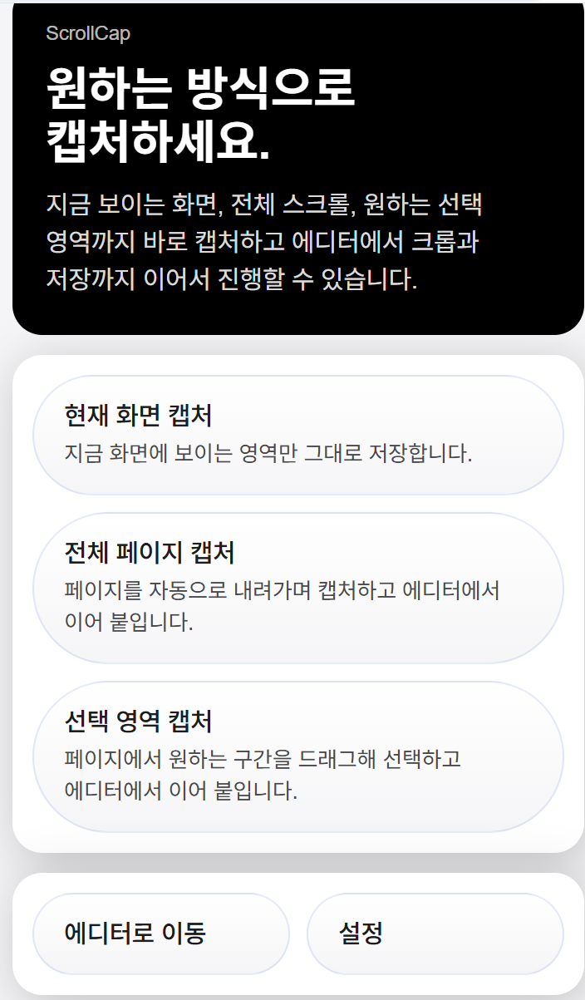 | 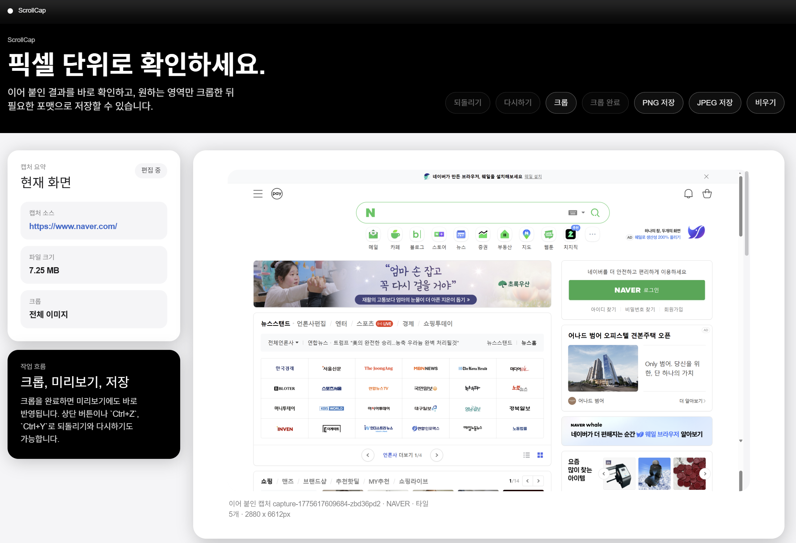 |

#### 프로젝트 소개

GoFullPage · FireShot 계열의 사용 경험을 목표로 만든 **Chrome MV3 기반 스크롤 캡처 확장 프로그램**입니다.  
현재 화면 캡처 → 전체 페이지 자동 스크롤 캡처 → 선택 영역 캡처 → 에디터에서 스티칭/크롭/저장까지 한 흐름으로 이어지도록 설계했습니다.

#### 어려웠던 점과 해결

| 문제 | 해결 |
|:--- |:--- |
| **MV3 구조 — 역할 분리** | `service worker`(세션 제어) · `content script`(DOM 조작) · `editor`(후처리)로 명확히 분리해 캡처 파이프라인을 구조화 |
| **스티칭 오차 · 중복** | 캡처마다 실제 `scrollX/Y`를 재측정해 tile metadata에 기록, "예상 위치"가 아닌 "실측 위치" 기반 스티칭으로 전환 |
| **선택 영역 자동 스크롤** | viewport 좌표와 문서 좌표를 분리 관리, `requestAnimationFrame` 기반 auto-scroll 중에도 선택 rect를 문서 좌표로 재계산 |
| **대용량 저장 안정성** | 이미지 프레임은 IndexedDB, 메타데이터는 `chrome.storage.local`, 설정은 `chrome.storage.sync`로 계층 분리; 20MB 이상 자동 분할 저장 |

#### 사용 기술

| 영역 | 기술 |
|:--- |:--- |
| **Core** | `TypeScript 5.8`, `Chrome Extensions MV3` |
| **Build** | `Vite`, `esbuild` |
| **Rendering** | `Canvas 2D API` |
| **Storage** | `IndexedDB`, `chrome.storage.local/sync` |
| **API** | `tabs`, `scripting`, `downloads`, `commands` |

#### 핵심 성과

- `service worker` · `content script` · `editor` 3계층 분리로 **MV3 제약 내에서 안정적인 캡처 파이프라인** 구현
- 실측 scroll 좌표 기반 스티칭으로 **긴 페이지에서도 픽셀 단위 이음매 오차 제거**
- IndexedDB 분리 저장 + 20MB 자동 분할로 **대용량 캡처 결과도 안정적으로 처리**
- 파일명 템플릿 · 자동 폴더 · Undo/Redo · PNG/JPEG 내보내기 등 **실사용 기준 설정 시스템** 완성
- 총 배포 JS **136KB**, 빌드 시간 평균 **0.585초** (esbuild 기준)

**[GitHub Repository](https://github.com/byjun98/ScrollCap)**

</details>
<br>

<details>
<summary><b>5. Open_Translator — YouTube 실시간 자막 번역 Chrome MV3 확장 프로그램</b></summary>
<br>

> **2026.04** · 1인 개발 (WXT · React 19 · TypeScript · Chrome Extensions MV3 · OpenAI-compatible Local Proxy)

#### 프로젝트 스크린샷

| 빠른 설정 팝업 | YouTube 플레이어 AI 메뉴 |
|:-------------:|:------------------------:|
| 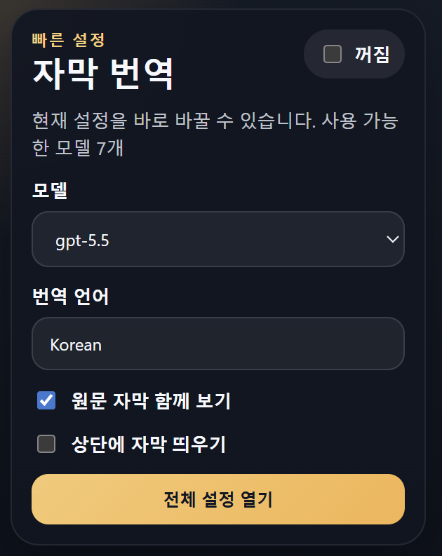 | 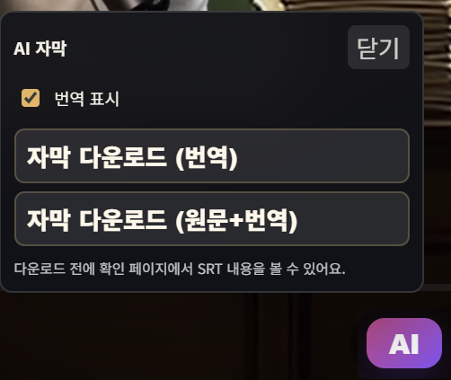 |

| SRT 확인/수정 페이지 | 로컬 프록시 설정 도우미 |
|:------------------:|:----------------------:|
| 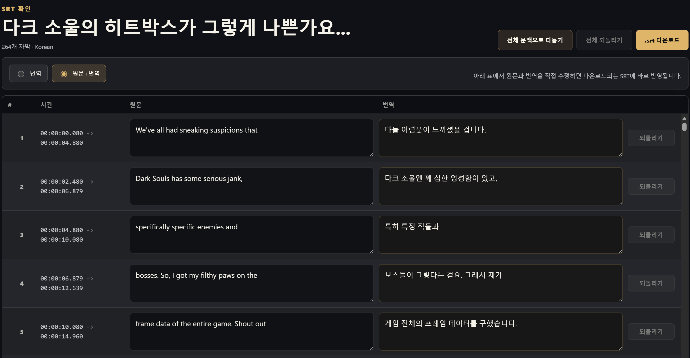 | 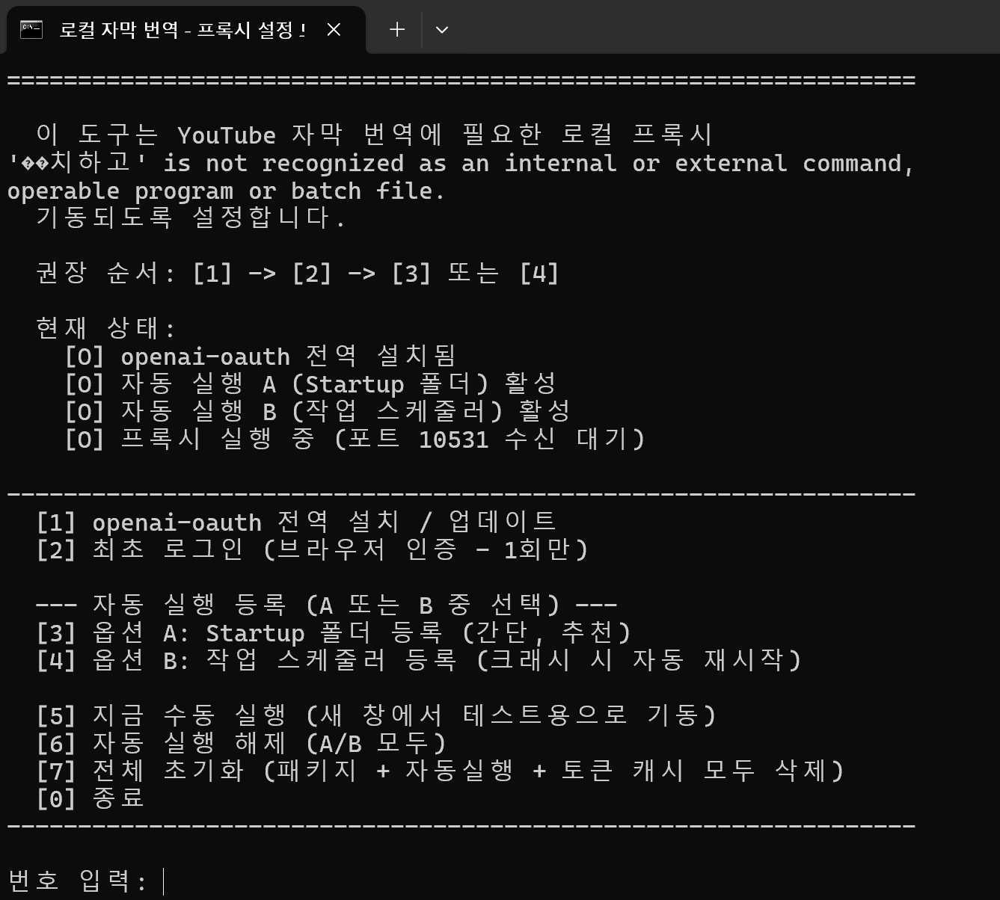 |

#### 프로젝트 소개

Open_Translator는 YouTube 영상의 자막 트랙을 읽고, 현재 재생 시간에 맞는 자막을 **로컬 OpenAI 호환 프록시**로 번역해 플레이어 위에 표시하는 Chrome MV3 확장 프로그램입니다.  
페이지 전체 번역이 아니라 **자막 cue와 영상 타임라인**을 기준으로 동작하며, 번역 결과는 실시간 오버레이뿐 아니라 `.srt` 파일로 내려받을 수 있도록 확인/수정 페이지까지 연결했습니다.

#### 어려웠던 점과 해결

| 문제 | 해결 |
|:--- |:--- |
| **YouTube SPA 이동과 자막 수집 타이밍** | `document_start`에서 page-world hook을 주입하고, videoId/route key 기준으로 caption track을 필터링해 이전 영상의 비동기 결과가 새 영상에 섞이지 않도록 처리 |
| **실시간성 vs 번역 품질** | 40개 cue 단위 문맥 번역을 미리 준비하되, 현재 cue의 문맥 번역이 늦으면 단문 번역을 먼저 표시하고 이후 문맥 번역으로 갱신 |
| **MV3 서비스 워커 제약** | `content script`(플레이어 UI/자막 상태) · `background`(설정/프록시 호출/캐시) · `preview page`(SRT 편집/다운로드)로 역할을 분리 |
| **플레이어 오버레이 간섭** | Shadow DOM 기반 UI와 `pointer-events` 분리, 전체화면/극장 모드/일반 화면의 viewport 보정으로 영상 조작을 방해하지 않도록 설계 |

#### 사용 기술

| 영역 | 기술 |
|:--- |:--- |
| **Core** | `WXT 0.20`, `React 19`, `TypeScript 5.9`, `Chrome Extensions MV3` |
| **YouTube** | `content script`, `page-world hook`, `InnerTube`, `timedtext caption tracks` |
| **AI/Proxy** | `OpenAI-compatible local proxy`, `/v1/chat/completions`, `/v1/models` |
| **Storage/Export** | `browser.storage.sync/local`, `SRT builder`, `runtime messaging` |

#### 프로젝트를 통해 배운 점

| 배운 점 | 구체적 내용 |
|:--- |:--- |
| **타임라인 기반 상태 동기화** | `video.currentTime`과 자막 cue index를 기준으로 화면 표시, 선번역, export 데이터를 같은 흐름에서 관리 |
| **오버레이 UI 설계** | 플레이어 위 HUD처럼 떠 있는 UI를 만들면서 클릭 영역, 전체화면, 화면 경계 보정을 함께 고려 |
| **비동기 작업 생명주기 관리** | route 전환, fetch abort, generation guard, 캐시 무효화를 통해 오래된 작업 결과가 현재 화면을 덮어쓰지 않도록 제어 |
| **로컬 실행 환경 분리** | 확장 프로그램은 localhost 권한만 갖고, 인증과 모델 호출은 로컬 프록시에 위임해 권한 범위를 좁힘 |

#### 핵심 성과

- YouTube 자막 cue 기반 **실시간 번역 오버레이**와 AI 메뉴 구현
- 문맥 번역 queue + 단문 fallback + 캐시 조합으로 **화면 공백을 줄이는 번역 흐름** 설계
- 다운로드 전 확인 페이지에서 원문/번역 직접 수정, 전체 문맥 다듬기, `.srt` 다운로드까지 연결
- 프록시 시작/중지 스크립트와 옵션 페이지를 포함해 **설치 후 사용 가능한 로컬 자막 번역 도구**로 정리

**[GitHub Repository](https://github.com/byjun98/Open_Translator)**

</details>
<br>

<details>
<summary><b>6. 족압 측정 앱 (FP2) — Arduino BLE + React Native</b></summary>
<br>

> **2024.03 ~ 2024.06** · 1인 개발 (React Native + Expo + Arduino)

<a href="https://github.com/byjun98/foot_pressure_arduino">
  
</a>

#### 프로젝트 스크린샷

| 2D 차트 (실시간)                                                                               | 3D 차트                                                                                     | 녹화 중                                                                                             |
|:-----------------------------------------------------------------------------------------:|:-----------------------------------------------------------------------------------------:|:------------------------------------------------------------------------------------------------:|
|  |  |  |

| BLE 연결                                                                                      | AI 건강 상담                                                                                       | 뉴스 피드                                                                                       |
|:-------------------------------------------------------------------------------------------:|:----------------------------------------------------------------------------------------------:|:-------------------------------------------------------------------------------------------:|
|  |  |  |

#### 프로젝트를 통해 배운 점

| 배운 점             | 구체적 내용                                               |
|:---------------- |:---------------------------------------------------- |
| **하드웨어 통신 프로토콜** | Arduino ESP32 BLE 데이터 파싱을 통해 외부 디바이스와의 저수준 통신 흐름을 이해 |
| **실시간 데이터 시각화**  | 16개 센서 데이터를 2D/3D 차트로 실시간 렌더링하며 프레임 단위 갱신 경험         |
| **녹화/리플레이 설계**   | 10초 단위 센서 데이터 스냅샷 저장 후 별도 화면에서 재분석하는 구조 설계           |
| **상태 관리 최적화**    | Context API → Zustand 전환으로 불필요한 리렌더링 제거, 화면 반응성 개선   |

#### 사용 기술

| 영역                | 기술                                               |
|:----------------- |:------------------------------------------------ |
| **Frontend**      | `React Native`, `Expo`, `TypeScript`             |
| **State**         | `Zustand`                                        |
| **Visualization** | `ECharts`, `ECharts-GL`, `WebView`               |
| **Hardware**      | `Arduino`, `ESP32`, `BLE (react-native-ble-plx)` |
| **Animation**     | `Reanimated`, `Moti`, `NativeWind`               |

#### 핵심 성과

- Zustand 전환으로 센서 데이터 갱신 시 **불필요한 리렌더링 제거** 및 반응성 개선
- 녹화 시점 클로저 버그, 빈 데이터 렌더 루프 등 **핵심 안정성 이슈** 해결
- 차트 로직 공통 컴포넌트화 + TypeScript 전환으로 **유지보수성** 향상

**[GitHub Repository](https://github.com/byjun98/foot_pressure_arduino)**

</details>
<br>

<div align="center">

**2024-2026 변현준 · Game Client Developer**

</div>


