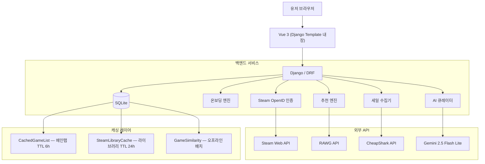

# 🎮 ChuraiGame — GameMatch

> **"무슨 게임 하지?"를 데이터로 해결하는 개인화 게임 추천 서비스**

게임을 **잘 모르는 사람**도 자신의 취향에 맞는 게임을 발견할 수 있도록 설계했습니다.  
Steam 라이브러리가 없어도 온보딩 평가만으로 추천을 받을 수 있고, Steam을 연동하면 플레이타임 기반의 더 정밀한 추천이 가능합니다.

<div align="center">


</div>

---

## 📌 목차

1. [왜 게임인가 — 프로젝트 동기](#1-왜-게임인가--프로젝트-동기)
2. [시연 영상](#2-시연-영상)
3. [주요 화면](#3-주요-화면)
4. [시스템 아키텍처](#4-시스템-아키텍처)
5. [추천 알고리즘 심층 분석](#5-추천-알고리즘-심층-분석)
6. [데이터 파이프라인](#6-데이터-파이프라인)
7. [기술적 의사결정](#7-기술적-의사결정)
8. [트러블슈팅 & 최적화](#8-트러블슈팅--최적화)
9. [ERD](#9-erd)
10. [프로젝트 구조](#10-프로젝트-구조)
11. [로컬 실행 방법](#11-로컬-실행-방법)
12. [면접 1분 요약](#12-면접-1분-요약)

---

## 1. 왜 게임인가 — 프로젝트 동기

Steam에는 **16만 개 이상**의 게임이 등록되어 있습니다. 게임을 좋아하는 사람조차 "다음에 뭘 하지?"라는 질문에 답하기 어렵고, **게임을 잘 모르는 사람**에게 이 선택지는 더더욱 압도적입니다.

기존 게임 클라이언트(Steam, Epic 등)의 추천 시스템은 **이미 게임을 많이 해본 유저**를 전제로 합니다. 구매 이력과 위시리스트가 충분해야 제대로 된 추천이 나오죠. 그래서 저희는 다른 방향을 잡았습니다:

> **"게임을 잘 몰라도, Steam 계정이 없어도, 취향을 찾아줄 수 있는 서비스"**

이를 위해 **온보딩 모달을 메인 플로우와 분리**했습니다. 처음 접속한 유저에게 "이 게임 해봤어요?"라고 가볍게 물어보고, 그 응답만으로 추천을 시작합니다. 게임 클라이언트는 "구매 → 플레이 → 추천"이라는 선순환을 전제하지만, 저희 서비스는 **"평가 → 추천 → 발견"**이라는 역방향 진입점을 만들었습니다.

---

## 2. 시연 영상

<div align="center">

https://github.com/user-attachments/assets/churai_game/Demonstration video.mp4

📁 `assets/churai_game/Demonstration video.mp4`

</div>

---

## 3. 주요 화면

### 메인 화면 — 취향 대시보드


- 유저의 **장르 분포를 도넛 차트**로 시각화
- 평가 데이터 기반으로 상위 장르를 자동 분석
- "요즘 뜨는", "평점 높은", "신작 게임" 탭별 캐러셀 브라우징
- 캐시 적중 시 **0.15초 내 렌더링** (RAWG API 직접 호출 대비 98% 단축)

---

### 온보딩 — Steam 게임 평가 모달


- Steam 리뷰 수 500개 이상 · 긍정률 75% 이상 게임 **500개** 선별
- 4단계 직관적 평가: 👎 별로예요 · ➖ 안 해봤어요 · 👍 재밌어요 · 🌟 인생게임!
- 점수 체계: `-1, 0, 3.5, 5` → 정규화 후 `-1.0 ~ 1.0` 범위로 변환
- 최소 **3개 평가** 시 즉시 Item-Based CF 추천 작동

---

### 🇰🇷 온보딩 — 한국 유행 게임 모달


- **"Steam을 안 써봤어요"** 유저를 위한 별도 온보딩 트랙
- 크레이지아케이드, 카트라이더, 리그 오브 레전드, 포켓몬 등 **국내 유행 게임 105개** 수록
- Steam 미연동 유저도 이 평가만으로 **추천 파이프라인에 즉시 합류**
- 게임 클라이언트에는 없는, **게임을 잘 모르는 사람을 위한 진입점**

> 💡 **왜 모달을 분리했는가?**  
> 게임 클라이언트는 "이미 플레이한 게임"이 전제 조건입니다. 하지만 저희 타깃 유저는 플레이 이력이 없을 수 있습니다.  
> 글로벌 인기 게임과 한국 유행 게임을 **별도 모달로 분리**하여, 유저의 게임 경험 수준에 맞는 진입점을 제공합니다.

---

### AI 큐레이터 — Gemini 기반 대화형 추천


- 유저의 **Steam 라이브러리 + 평가 데이터**를 프롬프트 컨텍스트에 주입
- "위쳐를 인생게임으로 평가했네요? 그러면 이건 어때요?" 같은 맥락 기반 추천
- 최근 **10개 메시지**만 히스토리에 포함하여 비용/지연 제어
- `maxOutputTokens=2048`, API 타임아웃 30초로 안전장치 설정
- 빠른 입력을 위한 **프리셋 버튼**: "액션 RPG 추천해줘", "혼자 할 수 있는 힐링 게임" 등

---

### AI 프로필 생성

| 업로드 화면 | 생성 결과 |
|:---:|:---:|
|  |  |

- 유저의 **선호 장르 분석 결과**를 반영한 AI 프로필 이미지 자동 생성
- Gemini 이미지 생성 모델 활용
- 참고용 사진 업로드 시 해당 스타일을 반영하여 생성

---

### 맞춤 추천 리스트


- **Item-Based CF + 장르 + 메타크리틱** 3가지 신호를 결합한 하이브리드 추천
- 추천 점수(100점 만점)와 평점을 함께 표시
- "추천도순 / 평점순 / 세일중" 정렬 지원
- Steam 연동 시 **이미 보유한 게임 자동 제외**

---

### 추천 상세 — 왜 이 게임을 추천했는가


- "The Witcher를 인생게임으로 평가해서 → 젤다를 추천"과 같이 **추천 근거를 명시**
- 게임 상세 페이지에서 스크린샷, 트레일러, Steam 리뷰 통합 표시
- 메타크리틱 점수, 장르 태그, 스토어 링크 제공

---

### 세일 인텔리전스

| 메인 세일 | 검색 & 필터 |
|:---:|:---:|
|  |  |

- CheapShark API 기반 **5,000개 이상** 세일 게임 수집
- "인기 게임 세일", "역대 최대 할인" 카테고리 분류
- 리뷰 수, 긍정률, 역대 최저가 여부를 한눈에 확인
- **Scam Filter**: 할인율만 높고 품질 낮은 게임 자동 필터링 (리뷰 500+ & 긍정 80%+)

---

## 4. 시스템 아키텍처



### 왜 Vue를 별도 서버로 분리하지 않았는가

> Vue.js를 CDN으로 Django 템플릿 안에 통합한 **하이브리드 방식**을 택했습니다.

- **CORS 문제 제거**: 프론트/백 분리 시 발생하는 Cross-Origin 이슈를 원천 차단
- **Django 인증 시스템 그대로 활용**: Session + CSRF 기반 인증을 별도 JWT 구현 없이 사용
- **배포 단순화**: 서버 1대로 프론트+백엔드 동시 서빙, 인프라 비용 절감
- **필요한 곳에만 Vue의 반응형 UI 적용**: 온보딩 모달, 챗봇, 캐러셀 등 동적 인터랙션이 필요한 컴포넌트에서만 Vue를 사용하고, 정적 페이지는 Django 템플릿으로 빠르게 렌더링

---

## 5. 추천 알고리즘 심층 분석

### 5-1. 2단계 파이프라인 구조

추천 시스템은 **"미리 계산"**과 **"실시간 조합"**을 분리한 2단계 파이프라인입니다.

```
┌─────────────────────────────────────────────────────┐
│  1단계: 오프라인 배치 (매일 새벽 실행)                    │
│                                                      │
│  GameRating 전체 → csr_matrix (희소행렬)                │
│  → cosine_similarity → GameSimilarity 테이블 저장       │
│                                                      │
│  ⚠️ game_a_id < game_b_id 정규화 → 저장쌍 50% 절감     │
│  ⚠️ Top-K만 유지 (기본 K=50) → 저장량 제한              │
└─────────────────────────────────────────────────────┘
                        ↓
┌─────────────────────────────────────────────────────┐
│  2단계: 실시간 추천 (유저 요청 시)                       │
│                                                      │
│  좋아한 게임 → GameSimilarity에서 후보 수집              │
│  → 하이브리드 가중합 계산 → 정렬 → 상위 N개 반환          │
└─────────────────────────────────────────────────────┘
```

### 5-2. 유사도 계산 공식

```python
# hybrid_similarity.py (실제 코드 기반)

SIMILARITY_WEIGHTS = {
    'collaborative': 0.70,   # 협업 필터링 (가장 중요)
    'genre':         0.20,   # 장르/태그 Jaccard 유사도
    'metacritic':    0.10,   # 메타크리틱 점수 유사도
}

final_similarity = (
    0.70 × collaborative_similarity +  # csr_matrix + cosine_similarity
    0.20 × genre_similarity +           # |A ∩ B| / |A ∪ B| (Jaccard Index)
    0.10 × metacritic_similarity        # 1 - |scoreA - scoreB| / 30
)
```

| 유사도 구성요소 | 비중 | 계산 방식 | 특징 |
|:---:|:---:|:---|:---|
| **협업 필터링** | 70% | 희소행렬 + 코사인 유사도 | 16만 게임을 오프라인 배치로 사전 계산. `(game_a, game_b)`를 `a < b`로 정규화하여 저장쌍 **50% 절감** |
| **장르 유사도** | 20% | Jaccard Index with weights | Tag 테이블에서 `slug` 기반 교집합/합집합 계산. 태그가 없으면 레거시 `genre` 문자열 폴백 |
| **메타크리틱** | 10% | 점수 차이 기반 선형 감쇠 | 30점 이상 차이나면 유사도 0. 정보 없으면 중립값 0.5 |

### 5-3. 콜드스타트 해결 전략

```
유저 접속
    │
    ├── 평가 데이터 없음 ──→ JSON 인기 게임 500개에서 즉시 추천 (API 호출 0회)
    │
    ├── 좋아요 없음 ──→ 평가한 게임 제외 후 인기 게임 재정렬
    │
    ├── 좋아요 있음 ──→ Item-Based CF 추천 시도
    │       │
    │       ├── 충분한 결과 ──→ 반환 (가중 평균 점수 기준 정렬)
    │       └── 부족 ──→ Content-Based (장르 매칭) 폴백
    │
    └── 모든 방법 실패 ──→ JSON 인기 게임 최종 폴백 (항상 성공 보장)
```

### 5-4. 추천 점수 산정

```python
# recommendation.py — 100점 만점 추천 점수

def calculate_recommendation_score(game, user_genres, is_on_sale, sale_discount):
    score  = genre_match_score    × 0.40   # 유저 선호 장르와의 적합도 (40점)
    score += metacritic_score     × 0.25   # 전문가 평점 60~100점을 0~25로 스케일링 (25점)
    score += user_rating_score    × 0.20   # RAWG 커뮤니티 평점 (20점)
    score += sale_bonus           × 0.15   # 할인 중이면 할인율 비례 보너스 (15점)
    return score
```

> 메타크리틱을 할인보다 **높은 가중치**로 설정한 이유:  
> 할인율만 높이면 저품질 게임이 상위에 오릅니다. "싸기만 한 게임"이 아니라 "좋은 게임이 마침 할인 중"인 상태를 추천하기 위해 품질 지표를 우선했습니다.

---

## 6. 데이터 파이프라인

16만 개 게임 데이터를 관리하기 위해 **11단계 배치 파이프라인**을 구성했습니다.  
각 단계는 독립적인 Django Management Command로 분리되어 있어, **실패 시 해당 단계만 재실행**할 수 있습니다.

```bash
# ─── 1단계: DB 초기화 ───
python manage.py makemigrations
python manage.py migrate

# ─── 2단계: Steam 세일 데이터 수집 ───
python manage.py update_steam_sales        # CheapShark API → JSON 파일 생성
                                            # 재시도/딜레이로 rate limit 대응

# ─── 3단계: 게임을 DB에 적재 ───
python manage.py load_games                # JSON → Game 테이블 적재
python manage.py add_korean_games          # 한국 유행 게임 105개 추가 (API 안 씀)

# ─── 4단계: 누락 가격 보강 ───
python manage.py fetch_missing_prices --steam-only --apply

# ─── 5단계: RAWG 데이터 보강 ───
python manage.py fetch_rawg_data           # rawg_id, 이미지, 설명이 없는 게임만 처리

# ─── 6단계: rawg_id 동기화 ───
python manage.py update_sale_rawg_ids      # DB ↔ JSON 간 rawg_id 매칭 (API 호출 0회)

# ─── 7단계: Steam 부가 데이터 ───
python manage.py fetch_steam_reviews       # 한국어 리뷰 수집
python manage.py fetch_steam_tags --english # 영문 태그 수집

# ─── 8단계: Game Pass ───
python manage.py update_gamepass           # Xbox Game Pass 게임 매칭

# ─── 9단계: 중복 정리 ───
python manage.py cleanup_duplicate_games --clear-invalid-rawg
python manage.py cleanup_duplicate_games --apply

# ─── 10단계: 유사도 계산 ───
python manage.py create_test_users         # 테스트 유저 생성 (개발용)
python manage.py calculate_game_similarity # 희소행렬 + cosine → GameSimilarity 테이블

# ─── 11단계: 캐시 워밍 ───
python manage.py refresh_game_cache        # 메인탭 RAWG 캐시 갱신
python manage.py cache_translations        # Gemini 번역 캐시 (시간 소요)
```

### 왜 이렇게 잘게 나눴는가?

1. **외부 API의 불안정성 대응**: Steam/RAWG/CheapShark는 rate limit, timeout, 결측값이 빈번합니다. 단일 스크립트로 만들면 한 번의 실패로 전체를 재실행해야 합니다.
2. **선택적 실행**: 세일 데이터만 갱신하고 싶으면 2단계만, 유사도만 재계산하고 싶으면 10단계만 실행합니다.
3. **시간 관리**: `cache_translations`는 게임당 4초(Gemini 무료 요금제 제한)이므로 수 시간이 걸립니다. 이를 다른 작업과 분리하여 병렬 실행이 가능합니다.

---

## 7. 기술적 의사결정

### 7-1. 데이터 저장 전략 — RDB와 JSON의 혼합

데이터의 **성격에 따라** 관계형 저장과 JSON 저장을 구분했습니다.

| 데이터 | 저장 방식 | 이유 |
|:---|:---|:---|
| 게임 메타데이터 (제목, 장르, 태그, 점수) | `Game` + `Tag` 테이블 정규화 | 검색, 필터링, 정렬이 필요 |
| Steam 라이브러리 (보유 게임 목록) | `SteamLibraryCache.library_data` JSON | 수백 개 게임 목록을 통째로 읽기 전용으로 사용. 관계 테이블로 풀면 JOIN 비용 증가 |
| 메인탭 캐시 (인기/트렌딩/신작) | `CachedGameList.games_data` JSON | RAWG 응답을 그대로 캐싱. TTL 6시간 |
| 세일 정보 | JSON 파일 + DB 필드 업데이트 | 휘발성 데이터이므로 영구 테이블보다는 주기적 덮어쓰기 방식 |
| 게임 유사도 | `GameSimilarity` 정규화 테이블 | 인덱스 기반 빠른 조회 필요. `(a, b)` 정규화로 중복 제거 |

> **요약**: 검색이 필요한 데이터는 DB 컬럼으로, 단순 조회 목적인 데이터는 JSON으로 저장하여 **성능과 유연성을 동시에 확보**했습니다.

### 7-2. AI 비용 최적화

| 용도 | 모델 | 이유 |
|:---|:---|:---|
| 게임 설명 번역 | Gemini 2.0 Flash Lite | 단순 번역 작업이므로 경량 모델로 충분. 무료 요금제 내에서 해결 |
| AI 큐레이터 대화 | Gemini 2.5 Flash Lite | 유저 컨텍스트를 이해하고 추론이 필요. 다만 히스토리를 10개로 제한 |
| 프로필 이미지 생성 | Gemini Image Generation | 유저 선호 장르를 반영한 캐릭터 이미지 생성 |

추가로, **한 번 번역된 텍스트나 추천 결과는 DB에 캐싱**하여 같은 API를 두 번 호출하지 않도록 했습니다. Rate limit은 **Thread Lock + 4초 간격** 제어로 무료 요금제(분당 15회)를 초과하지 않도록 설계했습니다.

### 7-3. 평점 정규화

온보딩의 4단계 평가를 추천 알고리즘이 사용할 수 있도록 **비선형 → 선형** 정규화를 적용합니다.

```
원본 점수    →  정규화 값  →  의미
  -1        →    -1.0     →  "싫어요" — 역가중치로 유사 게임 페널티
   0        →     0.0     →  "모르겠음" — 계산에서 제외
   3.5      →     0.7     →  "재밌어요" — 중간 가중치
   5        →     1.0     →  "인생게임" — 최대 가중치
```

> `3.5 → 0.7`과 `5 → 1.0` 사이의 간격(0.3)을 `-1 → -1.0`과 `0 → 0.0` 사이의 간격(1.0)보다 좁게 설정하여, **"좋아요"와 "인생게임"의 차이보다 "싫어요"의 영향력을 더 크게** 반영합니다.

---

## 8. 트러블슈팅 & 최적화

### A. RAWG 외부 호출 병목 해결

| 항목 | Before | After |
|:---|:---:|:---:|
| 추천 생성 시 API 호출 수 | 112회 | **3회** (97.3% 감소) |
| 메인 페이지 로딩 | ~9초 | **~0.15초** (98% 단축) |

- 추천 후보 수집을 3개 ordering(`-metacritic`, `-rating`, `-added`)으로 제한
- 각 요청 `page_size=40`, `max_pages=1`로 고정 → 최대 120개 후보로 bounded
- 메인탭은 `CachedGameList`에 카테고리별 JSON 저장, TTL 6시간

### B. 게임 유사도 저장 최적화

- `(game_a_id, game_b_id)` 쌍을 항상 `a < b`로 정규화 저장 → **중복쌍 50% 제거**
- Top-K(`K=50`) 랭크만 유지, 최소 유사도(`0.1`) 미만 절삭
- 조회 시 양방향 쿼리 (`game_a`에 있는 경우 + `game_b`에 있는 경우) 자동 처리

### C. 온보딩 품질 필터링

- `steam_rating >= 75`, `review_count >= 500` 조건으로 **저품질 게임 제외**
- 상위 **500개** 게임을 온보딩 풀로 유지 (다양성 확보)
- 한국 게임 목록은 **스핀오프/동명 게임 제외** 패턴 적용 (Bandle Tale, Wolf Among Us 등)

### D. 게임명 매칭 정합성

- Steam, RAWG, CheapShark 간 **동일 게임의 식별자가 다른** 문제
- 제목 정규화: 특수문자 제거, 에디션명 축약, 앞 2~3단어 비교 등 다단계 매칭
- `update_sale_rawg_ids` 커맨드로 JSON ↔ DB 간 `rawg_id`를 API 호출 없이 동기화

---

## 9. ERD


<details>
<summary>주요 테이블 설명 (클릭하여 펼치기)</summary>

| 테이블 | 역할 |
|:---|:---|
| `users_user` | Custom User Model. Steam ID, 소셜 로그인 연동 상태 관리 |
| `games_game` | 게임 기본 정보. steam_appid, rawg_id, metacritic_score 등 |
| `games_tag` | 장르/태그 (slug, tag_type, weight). Jaccard 유사도 계산에 사용 |
| `users_gamerating` | 온보딩/일반 평가. score: -1, 0, 3.5, 5 |
| `users_gamesimilarity` | 게임 간 유사도. `game_a_id < game_b_id` 정규화 저장 |
| `users_steamlibrarycache` | Steam 라이브러리 JSON 캐시. TTL 24시간 |
| `games_cachedgamelist` | 메인탭 RAWG 응답 캐시. TTL 6시간 |
| `users_onboardingstatus` | 온보딩 진행 상태 추적 |
| `games_steamreview` | Steam 한국어 리뷰 크롤링 데이터 |

</details>

---

## 10. 프로젝트 구조

```text
ChuraiGame/
├── ChuraiGame/                    # Django settings, urls, wsgi
├── users/                         # 인증, Steam 연동, 온보딩, 추천, AI 채팅
│   ├── views.py (93KB)            # 메인 뷰 + API 엔드포인트
│   ├── onboarding.py              # 콜드스타트 해결 + Item-Based CF 배치 계산
│   ├── recommendation.py          # RAWG 기반 개인화 추천 엔진
│   ├── hybrid_similarity.py       # 하이브리드 유사도 (CF 70% + 장르 20% + 메타크리틱 10%)
│   ├── steam_auth.py              # Steam OpenID 2.0 인증 핸들러
│   ├── google_auth.py             # Google OAuth 연동
│   ├── naver_auth.py              # 네이버 OAuth 연동
│   ├── templates/users/           # Vue 3 컴포넌트가 내장된 Django 템플릿 (18개)
│   └── management/commands/       # 데이터 파이프라인 배치 커맨드 (9개)
│       ├── calculate_game_similarity.py
│       ├── update_steam_sales.py
│       ├── add_korean_games.py
│       ├── create_test_users.py
│       └── ...
├── games/                         # 게임 모델, RAWG/번역/리뷰 처리, 캐시
│   ├── views.py                   # 게임 상세, 검색, 캐시 API
│   ├── utils.py (40KB)            # RAWG API 래퍼, 번역, 캐시 유틸리티
│   ├── models.py                  # Game, Tag, CachedGameList, SteamReview 등
│   └── management/commands/       # RAWG/Steam 데이터 수집 커맨드 (10개)
│       ├── fetch_rawg_data.py
│       ├── fetch_steam_reviews.py
│       ├── refresh_game_cache.py
│       └── ...
├── community/                     # 게시글, 댓글, 좋아요
├── gemini_client.py               # Gemini API 클라이언트 (Rate Limiter 내장)
├── templates/base.html            # 전역 Base 템플릿
├── assets/churai_game/            # 스크린샷 & 시연 영상
└── erd.png                        # ERD 다이어그램
```

---

## 11. 로컬 실행 방법

### 사전 준비

- Python 3.9+
- `.env` 파일에 API 키 설정:
  ```env
  RAWG_API_KEY=your_rawg_api_key
  GEMINI_API_KEY=your_gemini_api_key
  STEAM_API_KEY=your_steam_api_key
  ```

### 설치

```bash
git clone <repo_url>
cd ChuraiGame
python -m venv .venv
source .venv/bin/activate  # Windows: .venv\Scripts\activate
pip install -r requirements.txt
```

### 최소 실행 (빠른 시작)

```bash
python manage.py migrate
python manage.py load_games
python manage.py refresh_game_cache
python manage.py runserver
```

### 전체 파이프라인 (추천 시스템 완전 구동)

```bash
python manage.py update_steam_sales
python manage.py add_korean_games
python manage.py fetch_missing_prices --steam-only --apply
python manage.py fetch_rawg_data
python manage.py update_sale_rawg_ids
python manage.py fetch_steam_reviews
python manage.py fetch_steam_tags --english
python manage.py cleanup_duplicate_games --apply
python manage.py calculate_game_similarity --min-ratings 3 --top-k 50
python manage.py cache_translations --limit=50
```

접속: [http://localhost:8000](http://localhost:8000)

---

<div align="center">

**츄라이게임 팀**

사용된 모든 게임 이미지의 저작권은 각 개발사/배급사에 있습니다.

</div>
